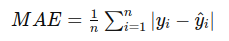

## QM-01 MeanAbsoluteError

### Beschreibung

Der Mean Absolute Error (MAE) ist eine Metrik zur Bewertung der Genauigkeit eines Vorhersagemodells. Er berechnet sich als der durchschnittliche absolute Betrag der Abweichungen zwischen den tatsächlichen und den vorhergesagten Werten. Aufgrund des Betrags ist der MAE unempfindlicher gegenüber großen Abweichungen.

Im Rahmen der Data Preparation kann der mittlere absolute Fehler über die Nutzung anderer ähnliche Datenmodelle Rückschluss auf potentielle Werte bei der Data Imputation geben. 

### Formel

### Pythoncode für "MeanAbsoluteError"
| RefID | Verweis                        |
| ----- | ------------------------------ |
| 1     | QM-01_MeanAbsoluteError_python |

### Referenzen
| RefID | Verweis                                                              | Kurzbeschr.                                                                                                                                                                                                                                                                                             |
| ----- | -------------------------------------------------------------------- | ------------------------------------------------------------------------------------------------------------------------------------------------------------------------------------------------------------------------------------------------------------------------------------------------------- |
| 100   | An Introduction to Statistical Learning: with Applications in Python | Präsentiert im wesentlichen ein statistisches Lernwerkzeug für Praktiker in Wissenschaft, Industrie und anderen Bereichen. Demonstriert die Anwendung der statistischen Lernmethoden in Python. Behandelt Regression, Klassifizierung, Baummethoden, SVM, Clustering, Überlebensanalyse, Deep Learning. |
| 126   | Statista - das Statistik-Portal: Statistiken, Marktdaten & Studien   | Statista ist eine Datenplattform, die Statistiken und Berichte aus verschiedenen Branchen und Märkten bereitstellt. Sie bietet Umfragen, Prognosen und Analysen zu Themen wie Wirtschaft, Gesellschaft und Technologie für Unternehmen, Forscher und Medien.                                            |

