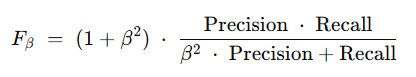

## QM-03 F-Measure

### Beschreibung

In der statistischen Analyse der binären Klassifizierung und von Information-Retrieval-Systeme ist der F-Score (auch F1-Score, deutsch: F-Maß) ein Maß für die Vorhersageleistung. Er wird aus der Präzision und der Trefferquote des Tests berechnet, wobei die Präzision die Anzahl der wahren positiven Ergebnisse geteilt durch die Anzahl aller als positiv vorhergesagten Proben ist, einschließlich jener, die nicht korrekt identifiziert wurden und die Trefferquote die Anzahl der wahren positiven Ergebnisse geteilt durch die Anzahl aller Proben, die als positiv identifiziert werden sollten, ist. 

Präzision ist auch als positiver Vorhersagewert und die Trefferquote ist in der diagnostischen binären Klassifizierung auch als Sensitivität bekannt.

Der F1-Score ist besonders nützlich, wenn die Klassen unausgewogen sind oder wenn sowohl falsche Positive als auch falsche Negative wichtige Auswirkungen haben.

$ß$ : Gewichtungsfaktor

### Methode

- **Präzision (Precision):** Ermittelt wird, wie präzise das Modell in seinen Vorhersagen ist. Dazu werden alle positiven Vorhersagen betrachtet und überprüft, wie viele davon tatsächlich korrekt waren. Liegen beispielsweise 10 positive Vorhersagen vor, von denen 7 korrekt sind, beträgt die Präzision 7 von 10.
- **Recall:** Untersucht wird, wie vollständig das Modell die tatsächlichen positiven Fälle erfasst. Wenn es beispielsweise 15 tatsächliche positive Fälle gibt und das Modell 7 davon korrekt als positiv identifiziert, beträgt der Recall 7 von 15.
- **Kombination von Präzision und Recall:** Beide Metriken sind relevant, da sie unterschiedliche Aspekte der Leistung abbilden. Durch den F1-Score wird ein Mittelwert zwischen Präzision und Recall gebildet. Auf diese Weise führt ein Modell, das in einem der Bereiche schwächer abschneidet, nicht zu einem hohen F1-Score.
- **Interpretation des F1-Scores:** Der F1-Score bewegt sich stets zwischen 0 und 1, wobei 1 den optimalen Wert darstellt. Ein höherer F1-Score signalisiert, dass das Modell sowohl präzise als auch vollständig bei der Erkennung der positiven Fälle ist.

### Pythoncode für "F-Measure"
| RefID | Verweis                |
| ----- | ---------------------- |
| 3     | QM-03_F-Measure_python |

### Referenzen
| RefID | Verweis                                                                                                                               | Kurzbeschr.                                                                                                                                                                                                                                                  |
| ----- | ------------------------------------------------------------------------------------------------------------------------------------- | ------------------------------------------------------------------------------------------------------------------------------------------------------------------------------------------------------------------------------------------------------------ |
| 126   |  Statista - das Statistik-Portal: Statistiken, Marktdaten & Studien                                                                   | Statista ist eine Datenplattform, die Statistiken und Berichte aus verschiedenen Branchen und Märkten bereitstellt. Sie bietet Umfragen, Prognosen und Analysen zu Themen wie Wirtschaft, Gesellschaft und Technologie für Unternehmen, Forscher und Medien. |
| 276   |  ISO/IEC TS 4213:2022 - Information technology — Artificial intelligence — Assessment of machine learning classification performance  | Information technology — Artificial intelligence — Assessment of machine learning classification performance                                                                                                                                                 |
