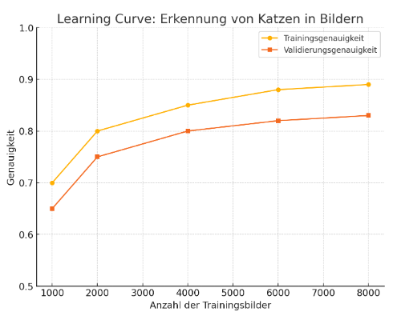

## QM-08 LearningCurve

### Beschreibung

Mittels einer "Learning Curve" kann die Abhängigkeit einer Trainings- oder Validierungsmetrik (z.B. Genauigkeit) von der Größe des Datensatzes ausgedrückt werden (z.B. in Form eines Plots). Dadurch kann visualisiert werden, ob es ab einer gewissen Datensatzgröße zu einer Saturierung des Trainingsprozesses kommt.

"Learning Curves" werden in der englischsprachigen Literatur mitunter auch als "Training Curve" bezeichnet. Diese Methode kann erst im Trainingsprozess Aufschluss darüber geben, ob der Datensatz groß genug gewählt wurde. 

### Methode

- **Datensatzaufteilung:** Der gesamte Datensatz wird in Trainings- und Validierungsdaten aufgeteilt.
- **Modelltraining mit verschiedenen Datengrößen:** Das Modell wird wiederholt mit einer kleinen Menge an Trainingsdaten trainiert; anschließend wird die Größe des Trainingsdatensatzes schrittweise erhöht.
- **Leistungsmessung:** Nach jedem Trainingsschritt werden die Trainings- und Validierungsmetriken (z. B. Genauigkeit oder Fehler) gemessen.
- **Erstellen der Learning Curve:** Die gemessenen Metriken werden auf der y-Achse und die Größe des Trainingsdatensatzes auf der x-Achse in einem Diagramm dargestellt, um die Learning Curve zu erstellen.
- **Analyse der Kurve:** Die Form der Kurven wird analysiert, um zu beurteilen, ob das Modell über- oder unterangepasst ist oder ob der Trainingsprozess eine Sättigung erreicht hat.
- **Entscheidungen treffen:** Die gewonnenen Erkenntnisse dienen dazu, festzustellen, ob weitere Daten benötigt werden, das Modell angepasst werden muss oder andere Änderungen im Trainingsprozess erforderlich sind.

### Beispiel - Erkennung von Katzen und Hunden

Ziel: Ein Modell trainieren, das Katzen in Bildern erkennt, und dabei sicherstellen, dass wir genug Daten verwenden, um eine gute Leistung zu erzielen.

- **Datensatzaufteilung:** Aus einem Datensatz von 10000 Bildern, die Katzen und andere Objekte zeigen, wurden 8000 Bilder für das Training und 2000 Bilder für die Validierung ausgewählt.
- **Modelltraining mit verschiedenen Datengrößen:**
    - Zunächst erfolgte das Training des Modells mit 1000 Trainingsbildern.
    - Anschließend wurde die Anzahl der Trainingsbilder schrittweise auf 2000, 4000, 6000 und schließlich 8000 Bilder erhöht.
- **Leistungsmessung:** Nach jedem Trainingsschritt wurden die Trainingsgenauigkeit (Bewertung der Modellleistung auf den Trainingsdaten) und die Validierungsgenauigkeit (Bewertung der Modellleistung auf den bisher ungenutzten Validierungsdaten) ermittelt.
- **Erstellen der Learning Curve:** Ein Diagramm wurde angelegt, in dem die x-Achse die Anzahl der Trainingsbilder (1000, 2000, 4000, 6000, 8000) und die y-Achse die Modellgenauigkeit darstellt. In diesem Diagramm wurden zwei Kurven abgebildet: eine für die Trainingsgenauigkeit und eine für die Validierungsgenauigkeit.
- **Analyse der Kurve:**
    - **Frühe Phase (1000 bis 4000 Bilder):** Beide Kurven (Trainings- und Validierungsgenauigkeit) steigen, wobei die Validierungsgenauigkeit deutlich unter der Trainingsgenauigkeit bleibt. Dies deutet darauf hin, dass der Datenumfang noch nicht ausreicht und das Modell weiterhin lernt.
    - **Mittlere Phase (4000 bis 6000 Bilder):** Die Trainingsgenauigkeit bleibt hoch, während die Validierungsgenauigkeit zu stabilisieren beginnt. Dies spricht für eine Leistungsverbesserung, könnte jedoch auch auf beginnendes Overfitting hinweisen.
    - **Späte Phase (6000 bis 8000 Bilder):** Die Validierungsgenauigkeit stabilisiert sich weiter und nähert sich der Trainingsgenauigkeit an. Ein signifikanter Leistungsanstieg durch zusätzliche Daten ist nicht erkennbar. Das Modell erreicht daher eine Sättigung.

- Entscheidungen treffen:
    - Da die Leistung des Modells bei 6000 bis 8000 Bildern stabil bleibt, könnten wir schließen, dass zusätzliche Trainingsdaten über 8000 Bilder hinaus nicht wesentlich zur Verbesserung der Modellleistung beitragen.
    - Stattdessen könnte es sinnvoll sein, andere Methoden auszuprobieren, wie z.B. das Modell zu optimieren oder mehr Regularisierung zu verwenden, um die Generalisierungsfähigkeit des Modells zu verbessern.

### Sourcecode "LearningCurve"
| RefID | Verweis                    |
| ----- | -------------------------- |
| 8     | QM-08 LearningCurve_python |

### Referenzen
| RefID | Verweis                                                                | Kurzbeschr.                                                                                                                                                                                                                                                                                                                                  |
| ----- | ---------------------------------------------------------------------- | -------------------------------------------------------------------------------------------------------------------------------------------------------------------------------------------------------------------------------------------------------------------------------------------------------------------------------------------- |
| 100   |  An Introduction to Statistical Learning: with Applications in Python  | Präsentiert im wesentlichen ein statistisches Lernwerkzeug für Praktiker in Wissenschaft, Industrie und anderen Bereichen. Demonstriert die Anwendung der statistischen Lernmethoden in Python. Behandelt Regression, Klassifizierung, Baummethoden, SVM, Clustering, Überlebensanalyse, Deep Learning.                                      |
| 168   |  The Shape of Learning Curves: A Review                                | Die Studie bietet einen umfassenden Überblick über Lernkurven, deren Formen und Einflussfaktoren, zeigt jedoch, dass es keine universelle Modellierung gibt, da Lernkurven unterschiedlich und teils unvorhersehbar verlaufen können.                                                                                                        |
| 246   |  Learning curve (machine learning)                                     | Beim maschinellen Lernen visualisiert eine Lernkurve die Beziehung zwischen Lernaufwand (z. B. Anzahl der Trainingsbeispiele) und Vorhersageleistung (z. B. Genauigkeit bei Testdaten) und hilft dabei, Algorithmen zu vergleichen, Modellparameter abzustimmen, die Optimierung zu verbessern und über Trainingsdaten zu entscheiden Menge. |
