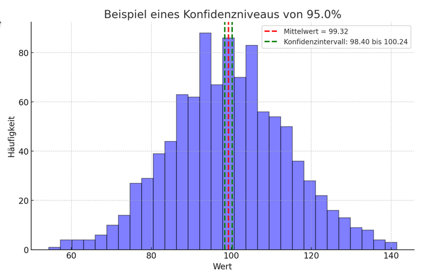

## QM-09 Konfidenz Niveau

### Beschreibung

Das Konfidenzniveau beschreibt die Wahrscheinlichkeit, mit der die Schätzung eines statistischen Parameters, wie zum Beispiel eines Mittelwerts, aus einer Stichprobe auch für die gesamte Population gültig ist.

### Darstellung:

In diesem Fall wurde eine Stichprobe mit einem Mittelwert von 100 und einer Standardabweichung von 15 generiert. Das Konfidenzniveau ist auf 95% festgelegt, was bedeutet, dass wir 95% sicher sein können, dass das wahre Mittel der Gesamtpopulation innerhalb des grün gestrichelten Bereichs liegt. Der rote gestrichelte Balken markiert den Mittelwert der Stichprobe, während die grünen Linien das Konfidenzintervall anzeigen.

### Python Code für "KonfidenzNiveau"

| RefID | Verweis                      |
| ----- | ---------------------------- |
| 9     | QM-09_KonfidenzNiveau_python |

### Referenzen

| RefID | Verweis              | Kurzbeschr.                                                                                                                                                                                                                                                                                                                                            |
| ----- | -------------------- | ------------------------------------------------------------------------------------------------------------------------------------------------------------------------------------------------------------------------------------------------------------------------------------------------------------------------------------------------------ |
| 240   |  Konfidenzintervall  | Ein Konfidenzintervall ist ein in der frequentistischen Statistik genutzter Wertebereich, der mit einer bestimmten Wahrscheinlichkeit (z. B. 95 %) den wahren Parameter einer Verteilung einschließt und die Präzision der Schätzung angibt, wobei diese Wahrscheinlichkeit eine Eigenschaft des Schätzverfahrens und nicht des Intervalls selbst ist. |

