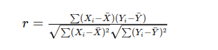

## QM-11-1 Pearson-Korrelationskoeffizient

### Beschreibung
Der Pearson-Korrelationskoeffizient (auch unter Bravais-Pearson-Korrelationskoeffizient zu finden), oft einfach als Pearsons "r" bezeichnet, ist ein statistisches Maß, das die Stärke und Richtung des linearen Zusammenhangs zwischen zwei Variablen quantifiziert. Er gibt an, wie gut eine lineare Beziehung zwischen den Variablen durch eine Gerade beschrieben werden kann.

Der Pearson-Korrelationskoeffizient ist am besten geeignet für **metrische Daten**, also kontinuierliche Variablen, die auf einer **Intervall-** oder **Verhältnisskala** gemessen werden. 

- **Interpretation**:
    - **Positive Werte** deuten auf einen positiven Zusammenhang hin (z. B. wenn die eine Variable steigt, steigt auch die andere).
    - **Negative Werte** deuten auf einen negativen Zusammenhang hin (z. B. wenn die eine Variable steigt, sinkt die andere).
    - **Werte nahe 0** deuten darauf hin, dass kein linearer Zusammenhang besteht.
- **Anwendung**: Der Pearson-Korrelationskoeffizient wird häufig verwendet, um zu verstehen, ob und wie stark zwei Variablen miteinander zusammenhängen, was in vielen wissenschaftlichen, wirtschaftlichen und sozialen Untersuchungen wichtig ist.
    
- **Voraussetzungen**:
    - Die Daten sollten in einem intervall- oder verhältnisskalierten Format vorliegen.
    - Die Beziehung zwischen den Variablen sollte linear sein.
    - Die Daten sollten normalverteilt sein, insbesondere wenn Hypothesentests durchgeführt werden.

### Formel

- $X_i$​ und $Y_i$​ sind die einzelnen Werte der Variablen X und Y.
- $bar X$ und $bar Y$ sind die Mittelwerte der Variablen X und Y.
- Die Summe läuft über alle Paare von Werten $X_i$​ und $Y_i$​ im Datensatz.

### Beispiele 

#### Beispiele für geeignete Daten:

- **Beziehung zwischen Körpergröße und Gewicht**: Untersuchen, ob größere Menschen tendenziell mehr wiegen.
- **Temperatur und Eiskonsum**: Analysieren, ob bei höheren Temperaturen mehr Eis konsumiert wird.
- **Verkaufszahlen und Werbebudget**: Untersuchung, ob ein höheres Werbebudget mit höheren Verkaufszahlen korreliert.
- **Bildungsniveau und Einkommen**: Untersuchen, ob ein höheres Bildungsniveau mit einem höheren Einkommen verbunden ist.

### Sourcecode "Pearson-Korrelationskoeffizient"

| RefID | Verweis                                        |
| ----- | ---------------------------------------------- |
| 11    | QM-11-1_Pearson-Korrelationskoeffizient_python |

### Referenzen

| RefID | Verweis                                                       | Kurzbeschr.                                                                                                                                                                                                                                                                                       |
| ----- | ------------------------------------------------------------- | ------------------------------------------------------------------------------------------------------------------------------------------------------------------------------------------------------------------------------------------------------------------------------------------------- |
| 244   |  Korrelationskoeffizient nach Bravais-Pearson                 | Der Korrelationskoeffizient nach Bravais-Pearson misst den Grad des linearen Zusammenhangs zwischen zwei mindestens intervallskalierten Merkmalen, ist dimensionslos, nimmt Werte zwischen -1 und +1 an und wurde von Karl Pearson formal begründet.                                              |
| 258   |  Analyzing Dataset Annotation Quality Management in the Wild  | Diese Studie untersucht Qualitätsmanagementpraktiken in 591 Veröffentlichungen zu Textdatensätzen und zeigt trotz häufiger Anwendung guter Praktiken, dass 30 % unzureichend sind, wobei häufige Fehler bei der Übereinstimmung der Annotatoren und der Fehlerquotenberechnung aufgedeckt werden. |
