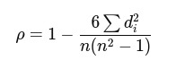

## QM-11-2 Spearman-Rangkorrelationskoeffizient

### Beschreibung

Der Spearman-Rangkorrelationskoeffizient, auch als Spearmans ρ (rho) bezeichnet, ist ein nichtparametrisches Maß für die Stärke und Richtung des monotonen Zusammenhangs zwischen zwei Rangreihen von Variablen. 

Im Gegensatz zum Pearson-Korrelationskoeffizienten, der lineare Zusammenhänge misst, bewertet der Spearman-Koeffizient, wie gut die Beziehung zwischen den Variablen durch eine monotone Funktion beschrieben werden kann, unabhängig von der konkreten Form dieser Funktion. Er nimmt Werte zwischen -1 und 1 an, wobei -1 eine perfekte negative, 0 keine und 1 eine perfekte positive monotone Korrelation anzeigt.

Der Spearman-Rangkorrelationskoeffizient ist am besten für ordinal skalierte Daten oder kontinuierliche Daten geeignet, bei denen die Beziehung zwischen den Variablen monoton, aber nicht notwendigerweise linear ist. Er ist ideal, wenn die Daten nicht normalverteilt sind oder Ausreißer enthalten, die die Analyse beeinflussen könnten.
### Formel

- $d_i$​ die Differenz zwischen den Rangplätzen jedes Paares (Rang von $X_i$​ minus Rang von $Y_i$​),
- $n$ die Anzahl der Beobachtungen.

Diese Formel gilt, wenn keine Rangbindungen (gleiche Rangwerte) vorliegen. Wenn es Rangbindungen gibt, wird eine angepasste Methode verwendet, die oft mithilfe von Kovarianzen der Rangwerte berechnet wird.

### Sourcecode "Spearman-Rangkorrelationskoeffizient"

| RefID | Verweis                                             |
| ----- | --------------------------------------------------- |
| 12    | QM-11-2_Spearman-Rangkorrelationskoeffizient_python |

### Referenzen

| RefID | Verweis                                                       | Kurzbeschr.                                                                                                                                                                                                                                                                                       |
| ----- | ------------------------------------------------------------- | ------------------------------------------------------------------------------------------------------------------------------------------------------------------------------------------------------------------------------------------------------------------------------------------------- |
| 59    |  Rangkorrelationskoeffizient                                  | Ein Rangkorrelationskoeffizient ist ein parameterfreies Maß für die Korrelation zwischen Variablen, das auf den Rängen der beobachteten Werte basiert und keine linearen Annahmen über deren Beziehung voraussetzt, wobei Spearman's Rho und Kendall's Tau die bekanntesten Vertreter sind.       |
| 258   |  Analyzing Dataset Annotation Quality Management in the Wild  | Diese Studie untersucht Qualitätsmanagementpraktiken in 591 Veröffentlichungen zu Textdatensätzen und zeigt trotz häufiger Anwendung guter Praktiken, dass 30 % unzureichend sind, wobei häufige Fehler bei der Übereinstimmung der Annotatoren und der Fehlerquotenberechnung aufgedeckt werden. |
