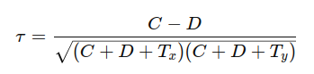

## QM-11-3 Kendalls Tau

### Beschreibung

Kendalls Tau ist ein nichtparametrischer Korrelationskoeffizient, der die Stärke und Richtung des Zusammenhangs zwischen zwei ordinalen oder ranggeordneten Variablen misst. Ähnlich wie der Spearman-Rangkorrelationskoeffizient ist Kendall's Tau besonders nützlich, wenn die Daten keine lineare Beziehung aufweisen oder wenn die Daten ordinal (d. h. in Rängen) sind.

Insgesamt ist Kendalls Tau ideal, wenn man eine robuste Analyse der Beziehung zwischen zwei ordinalen oder rangbasierten Variablen durchführen möchte, insbesondere wenn man nicht sicher ist, ob die Beziehung linear ist oder wenn man Ausreißer in den Daten vermutet.

#### Arten von Kendall's Tau

Es gibt zwei Hauptvarianten von Kendall's Tau:

- **Kendall's Tau-b**: Diese Variante wird verwendet, wenn es Bindungen (Ties) in den Daten gibt, also gleiche Rangwerte in den Datensätzen. Tau-b korrigiert für diese Bindungen und ist daher besonders in Daten mit vielen Ties geeignet.
    
- **Kendall's Tau-c**: Diese Variante wird oft verwendet, wenn die beiden Variablen unterschiedlich viele mögliche Werte (Ränge) haben.

### Formel

- C die Anzahl der konkordanten Paare ist,
- D die Anzahl der diskordanten Paare ist,
- $T_x$​ die Anzahl der Bindungen nur in der ersten Variable ist,
- $T_y$​ die Anzahl der Bindungen nur in der zweiten Variable ist.

#### Formel für Kendall's Tau

Kendall's Tau basiert auf der Zählung von konkordanten und diskordanten Paaren:

- **Konkordante Paare**: Ein Paar $(x_i, y_i)$ und $(x_j, y_j)$ ist konkordant, wenn $x_i > x_j$ und $y_i > y_j$ oder $x_i < x_j$ und $y_i < y_j$.
- **Diskordante Paare**: Ein Paar $(x_i, y_i)$ und $(x_j, y_j)$ ist diskordant, wenn $x_i > x_j$ und $y_i < y_j$ oder $x_i < x_j$ und $y_i > y_j$.

#### Wertebereich und Interpretation

- $\tau = 1$: Perfekte positive Korrelation (alle Paare sind konkordant).
- $\tau = -1$: Perfekte negative Korrelation (alle Paare sind diskordant).
- $\tau = 0$: Keine Korrelation (gleich viele konkordante und diskordante Paare).

### Sourcecode "Kendalls Tau"

| RefID | Verweis                     |
| ----- | --------------------------- |
| 13    | QM-11-3_Kendalls Tau_python |

### Referenzen

| RefID | Verweis                       | Kurzbeschr.                                                                                                                                                                                                                                                                                 |
| ----- | ----------------------------- | ------------------------------------------------------------------------------------------------------------------------------------------------------------------------------------------------------------------------------------------------------------------------------------------- |
| 59    |  Rangkorrelationskoeffizient  | Ein Rangkorrelationskoeffizient ist ein parameterfreies Maß für die Korrelation zwischen Variablen, das auf den Rängen der beobachteten Werte basiert und keine linearen Annahmen über deren Beziehung voraussetzt, wobei Spearman's Rho und Kendall's Tau die bekanntesten Vertreter sind. |
