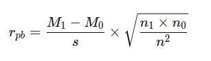

## QM-11-4 Koeffizient der punktbiserialen Korrelation

### Beschreibung

Der Koeffizient der punktbiserialen Korrelation ist ein statistisches Maß, das verwendet wird, um die Stärke und Richtung der Beziehung zwischen einer binären (dichotomen) Variablen und einer kontinuierlichen Variablen zu bewerten. Dieses Maß gehört zur Familie der Korrelationskoeffizienten und ist eine Spezialform der Pearson-Produkt-Moment-Korrelation. 
### Formel

- $M_1$ der Mittelwert der kontinuierlichen Variablen für die Gruppe ist, die durch den Wert 1 der binären Variablen repräsentiert wird,
- $M_0$ der Mittelwert der kontinuierlichen Variablen für die Gruppe ist, die durch den Wert 0 der binären Variablen repräsentiert wird,
- $s$ die Standardabweichung der kontinuierlichen Variablen über alle Fälle hinweg ist,
- $n_1$ die Anzahl der Fälle in der Gruppe 1 ist,
- $n_0$ die Anzahl der Fälle in der Gruppe 0 ist, und
- $n$ die Gesamtzahl der Fälle ist.

### Sourcecode "Koeffizient der punktbiserialen Korrelation"

| RefID | Verweis                                                    |
| ----- | ---------------------------------------------------------- |
| 14    | QM-11-4_Koeffizient der punktbiserialen Korrelation_python |

### Referenzen

| RefID | Verweis                      | Kurzbeschr.                                                                                                                                                                                                                           |
| ----- | ---------------------------- | ------------------------------------------------------------------------------------------------------------------------------------------------------------------------------------------------------------------------------------- |
| 113   |  Punktbiseriale Korrelation  | Die punktbiseriale Korrelation ist ein statistisches Maß zur Bestimmung des linearen Zusammenhangs zwischen einer dichotomen und einer intervallskalierten Variablen, das als Spezialfall des Pearson-Korrelationskoeffizienten gilt. |
