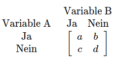
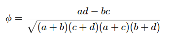

## QM-11-5 Phi-Koeffizient

### Beschreibung

Der Phi-Koeffizient wird aus einer 2x2-Kontingenztafel berechnet, die die Häufigkeiten der Kombinationen der Ausprägungen der beiden Variablen enthält. 

Der Phi-Koeffizient ist am besten geeignet für die Analyse von **binären (dichotomen) Daten**, insbesondere wenn beide Variablen genau zwei mögliche Ausprägungen haben. Es wird in der Regel verwendet, um die Stärke der Assoziation oder den Zusammenhang den beiden Variablen zu messen.

### Formel

Angenommen, die Kontingenztafel sieht wie folgt aus:

Hierbei sind a, b, c und d die Häufigkeiten der vier möglichen Kombinationen der Ausprägungen der beiden Variablen. Der Phi-Koeffizient kann dann wie folgt berechnet werden:

Der Wertebereich von ϕ liegt zwischen -1 und 1, ähnlich wie bei der Pearson-Korrelation.

####Interpretation 

- Ein ϕ von 1 bedeutet eine perfekte positive Assoziation, bei der die Ausprägungen der beiden Variablen perfekt übereinstimmen.
- Ein ϕ von -1 zeigt eine perfekte negative Assoziation an, bei der die Ausprägungen der beiden Variablen in perfektem Gegensatz zueinander stehen.
- Ein ϕ von 0 deutet darauf hin, dass keine Assoziation zwischen den Variablen besteht.

### Beispiele 

#### Beispiele für geeignete Daten:

- **Medizinische Studien**: Untersuchung des Zusammenhangs zwischen einer Behandlung (Behandelt/Nicht behandelt) und dem Ergebnis (Geheilt/Nicht geheilt).
- **Sozialwissenschaften**: Analyse des Zusammenhangs zwischen Geschlecht (Männlich/Weiblich) und einer bestimmten Präferenz (Ja/Nein).
- **Marktforschung**: Untersuchung des Zusammenhangs zwischen einer Kaufentscheidung (Gekauft/Nicht gekauft) und einer Werbemaßnahme (Gesehen/Nicht gesehen).

### Sourcecode "Phi-Koeffizient"

| RefID | Verweis                        |
| ----- | ------------------------------ |
| 15    | QM-11-5_Phi-Koeffizient_python |

### Referenzen

| RefID | Verweis                 | Kurzbeschr.                                                                                                                                                                                                                                                                                                     |
| ----- | ----------------------- | --------------------------------------------------------------------------------------------------------------------------------------------------------------------------------------------------------------------------------------------------------------------------------------------------------------- |
| 116   |  Kontingenzkoeffizient  | Der Kontingenzkoeffizient ist ein statistisches Maß zur Bestimmung des Zusammenhangs zwischen zwei nominalskalierten Variablen, das die beobachteten mit den erwarteten Häufigkeiten vergleicht und Werte zwischen 0 und 1 annimmt, wobei ein korrigierter Koeffizient für eine bessere Vergleichbarkeit sorgt. |
