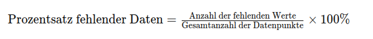
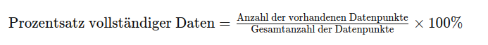
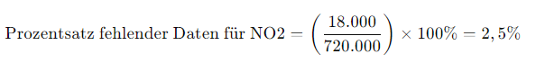
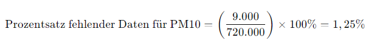

## QM-12 Prozentsätze auf Datensätzen

### Beschreibung

Prozentuale Anteile am Gesamtdatensatz sind zentrale Werkzeuge in der Datenqualitätssicherung und Datenanalyse. Sie ermöglichen eine quantitative Bewertung der Datenintegrität, indem sie den Anteil der vorhandenen bzw. fehlenden Datenpunkte in einem Datensatz bestimmen. Das Verständnis und die Anwendung dieser Formeln sind entscheidend, um die Aussagekraft von Analysen zu beurteilen und gegebenenfalls Maßnahmen zur Datenbereinigung oder -imputation einzuleiten.

### Formel

- Fehlende Datensätze 

- Vollständige Datensätze

### Beispiele 

#### Beispiel 1 - Fehlende Umweltdaten - Messung von Luftverschmutzung

Eine Umweltbehörde betreibt 1000 Sensoren in einer Stadt, um die Luftqualität kontinuierlich zu überwachen. Jeder Sensor sammelt jede Stunde Daten über verschiedene Schadstoffwerte (z. B. NO2, CO2, PM10). Innerhalb eines Monats (30 Tage) sollten insgesamt 720000 Messungen pro Schadstoff (1000 Sensoren x 24 Stunden x 30 Tage) aufgezeichnet werden.

Aufgrund technischer Probleme oder Wartungsarbeiten an den Sensoren fehlen jedoch Daten. Am Ende des Monats stellt die Behörde fest, dass 18000 Messungen für NO2 und 9000 Messungen für PM10 fehlen.

Für NO2:

Für PM10:

Die Behörde kann diese Prozentsätze nutzen, um die Qualität der Datenanalyse zu beurteilen. Ein höherer Prozentsatz fehlender Daten könnte die Genauigkeit der Luftqualitätsbewertungen beeinträchtigen und müsste bei der Interpretation der Ergebnisse berücksichtigt werden. Falls der Prozentsatz zu hoch ist, könnten zusätzliche Maßnahmen erforderlich sein, um die Datenlücken zu schließen oder alternative Methoden zur Datenimputation (Ersetzung der fehlenden Werte) anzuwenden.

#### Beispiel 2 - Vollständigkeit - Umfrage zur Kundenzufriedenheit

Ein Unternehmen führt eine Umfrage zur Kundenzufriedenheit durch, um Feedback von seinen Kunden zu erhalten. Die Umfrage enthält 20 Fragen, und das Unternehmen schickt diese an 1000 Kunden. Nach Ablauf der Umfragephase stellt das Unternehmen fest, dass 850 Kunden die Umfrage vollständig ausgefüllt haben. Die restlichen 150 Kunden haben entweder die Umfrage nicht ausgefüllt oder nur teilweise beantwortet.

- Gesamtanzahl der Datenpunkte: 

**Fehlende Daten:** Die 150 Kunden, die die Umfrage nicht oder nur teilweise ausgefüllt haben, fehlen jeweils mit 20 Fragen. Daher sind insgesamt 3000 Antworten (150 Kunden × 20 Fragen) nicht vorhanden.

- Anzahl der vorhandenen Datenpunkte: 

Anzahl der vorhandenen Datenpunkte=20000−3000=17000 Datenpunkte

- Berechnung des Prozentsatzes vollständiger Daten:

**Interpretation:** 
In diesem Fall beträgt der Prozentsatz vollständiger Daten 85 %, was bedeutet, dass 15 % der erwarteten Daten fehlen. Das Unternehmen hat ausreichend Daten gesammelt, um einige Analysen durchzuführen, muss aber die fehlenden 15 % berücksichtigen. Diese fehlenden Daten könnten die Genauigkeit und Repräsentativität der Ergebnisse beeinflussen, besonders wenn die fehlenden Antworten systematisch mit bestimmten Kundengruppen verbunden sind (z. B. unzufriedene Kunden, die die Umfrage nicht abgeschlossen haben). Möglicherweise muss das Unternehmen Methoden wie die Datenimputation in Betracht ziehen oder sich auf die Analyse der vorhandenen Daten beschränken.

### Referenzen

| RefID | Verweis                                                                                                                               | Kurzbeschr.                                                                                                  |
| ----- | ------------------------------------------------------------------------------------------------------------------------------------- | ------------------------------------------------------------------------------------------------------------ |
| 276   |  ISO/IEC TS 4213:2022 - Information technology — Artificial intelligence — Assessment of machine learning classification performance  | Information technology — Artificial intelligence — Assessment of machine learning classification performance |
