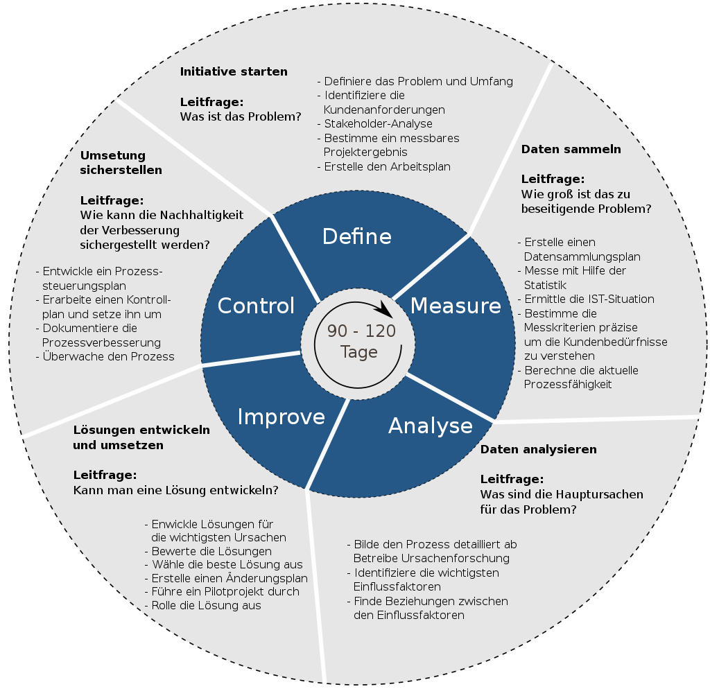

## QM-15 Six-Sigma Prozess

### Beschreibung
  
Die Six Sigma Prozessanalyse ist ein datengetriebener Ansatz, der darauf abzielt, die Qualität von Prozessen zu verbessern und Fehler zu minimieren. Six Sigma strebt nach nahezu Perfektion in Produktions- und Geschäftsprozessen und zielt darauf ab, die Fehlerquote auf weniger als 3,4 Defekte pro eine Million Möglichkeiten zu reduzieren.

| Sigma-level | DPMO    | fehlerhaft %  | fehlerfrei %   | Kurzfristiger Cpk | Langfristiger Cpk |
| ----------- | ------- | ------------- | -------------- | ----------------- | ----------------- |
| 1           | 691.462 | 68 %          | 32 %           | 0,33              | −0,17             |
| 2           | 308.538 | 31 %          | 69 %           | 0,67              | 0,17              |
| 3           | 66.807  | 6,7 %         | 93,3 %         | 1,00              | 0,5               |
| 4           | 6.210   | 0,62 %        | 99,38 %        | 1,33              | 0,83              |
| 5           | 233     | 0,023 %       | 99,977 %       | 1,67              | 1,17              |
| **6**       | **3,4** | **0,00034 %** | **99,99966 %** | **2,00**          | **1,5**           |
| 7           | 0,019   | 0,0000019 %   | 99,9999981 %   | 2,33              | 1,83              |
|             |         |               |                |                   |                   |
Das namensgebende Sigma bezieht sich auf die Standardabweichung $sigma$ (6$sigma$) . Das Vorkommen von Ausreißern kann anhand des x-fachen der Standardabweichung bestimmt werden. 

### Methode

Die Six Sigma Prozessanalyse verwendet statistische Methoden zur Identifizierung und Ausschaltung von Ursachen für Fehler oder Defekte in Geschäftsprozessen und ist typischerweise in fünf Phasen gegliedert, bekannt unter dem Akronym DMAIC:

- **Define (Definieren)**: In dieser Phase werden die Projektziele und Kundenanforderungen (interne und externe) klar definiert. Es wird bestimmt, was verbessert werden muss, und es werden spezifische Ziele festgelegt.
- **Measure (Messen)**: In dieser Phase werden die aktuellen Leistungsdaten des Prozesses erfasst. Es wird ein detailliertes Verständnis des aktuellen Prozesses entwickelt, einschließlich der Identifizierung der Schlüsselmaßzahlen für den Prozess, die für eine spätere Analyse verwendet werden.
- **Analyze (Analysieren)**: Hier werden die Daten analysiert, um die Ursachen für Fehler oder Mängel zu identifizieren. Es wird untersucht, welche Faktoren den Prozess negativ beeinflussen, und es werden Hypothesen über Ursache-Wirkungs-Zusammenhänge aufgestellt.
- **Improve (Verbessern)**: Auf Basis der Analyse werden Verbesserungen am Prozess vorgeschlagen und umgesetzt. Diese Phase umfasst die Entwicklung, das Testen und die Implementierung von Lösungen, die die größten Auswirkungen auf die Prozessleistung haben, sowie die Optimierung dieser Lösungen.
- **Control (Kontrollieren)**: In der letzten Phase wird der verbesserte Prozess kontinuierlich überwacht, um sicherzustellen, dass die Veränderungen dauerhaft wirksam sind. Es werden Kontrollsysteme eingeführt, um sicherzustellen, dass der Prozess weiterhin weniger Fehler produziert und stabil bleibt.

Von C64zottel - Eigenes Werk, CC BY-SA 4.0, https://commons.wikimedia.org/w/index.php?curid=107830220

### Referenzen

| RefID | Verweis                                                                        | Kurzbeschr.                                                                                                                                                                                      |
| ----- | ------------------------------------------------------------------------------ | ------------------------------------------------------------------------------------------------------------------------------------------------------------------------------------------------ |
| 52    |  Distributed Ledger for Provenance Tracking of Artificial Intelligence Assets  | Der Artikel entwirft ein Provenance-Modell für KI-Assets und implementiert ein sicheres Austauschprotokoll auf einer Blockchain, um Vertrauen, Datenschutz und Rückverfolgbarkeit zu verbessern. |

