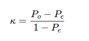

## QM-16-1 Interrater-Reliabilität

### Beschreibung

Interrater-Reliabilität misst die Übereinstimmung zwischen verschiedenen Beurteilern oder Bewertern. Ein häufig verwendetes Maß ist Cohens Kappa, das die beobachtete Übereinstimmung unter Berücksichtigung der zufälligen Übereinstimmung berechnet.

### Formel

### Sourcecode "Interrater Reliability"

| RefID | Verweis                                |
| ----- | -------------------------------------- |
| 17    | QM-16-1_Inter Rater Reliability_python |

### Referenzen

| RefID | Verweis                   | Kurzbeschr.                                                                                                                                                                                          |
| ----- | ------------------------- | ---------------------------------------------------------------------------------------------------------------------------------------------------------------------------------------------------- |
| 123   |  Cohens Kappa             | Cohen's Kappa ist ein statistisches Maß für die Interrater-Reliabilität, das die Übereinstimmung zwischen zwei Beurteilern bewertet. Es kann auch für die Intrarater-Reliabilität verwendet werden.  |
| 241   |  Interrater-Reliabilität  | Die Interrater-Reliabilität misst in der empirischen Sozialforschung die Übereinstimmung von Einschätzungsergebnissen verschiedener Beobachter und dient als Maß für die Objektivität einer Methode. |
