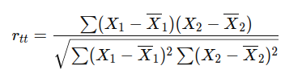

## QM-16-2 Test-Retest-Reliabilität

### Beschreibung

Die Test-Retest-Reliabilität wird durch Korrelation der Messwerte bei zwei verschiedenen Zeitpunkten berechnet. Dies wird oft mit dem Pearson-Korrelationskoeffizienten zwischen den beiden Messungen ermittelt.

### Formel

wobei $X_1$​ und $X_2$​ die Messwerte beim ersten bzw. zweiten Test sind und $bar_X_1$​ und $bar_X_2$​ die Mittelwerte dieser Messungen.

- Berechnung der Test-Retest Reliability:
    - Die Test-Retest Reliability wird typischerweise als Korrelationskoeffizient zwischen den Testergebnissen der beiden Zeitpunkte berechnet.
    - Ein hoher Korrelationskoeffizient (näher an 1) bedeutet, dass der Test zuverlässig ist, da die Ergebnisse stabil bleiben.
    - Ein niedriger Korrelationskoeffizient (näher an 0) zeigt eine geringe Zuverlässigkeit, was bedeutet, dass die Testergebnisse über die Zeit inkonsistent sind.

### Sourcecode "Test-Retest-Reliability"
| RefID | Verweis                                |
| ----- | -------------------------------------- |
| 18    | QM-16-2_Test-Retest-Reliability_python |

### Referenzen
| RefID | Verweis                    | Kurzbeschr.                                                                                                                                                                                                                                                                                                                                                                                                                                        |
| ----- | -------------------------- | -------------------------------------------------------------------------------------------------------------------------------------------------------------------------------------------------------------------------------------------------------------------------------------------------------------------------------------------------------------------------------------------------------------------------------------------------- |
| 110   |  Retest-Reliabilität       | Die Retest-Reliabilität beschreibt die Genauigkeit, mit der ein psychologisches Testverfahren ein Merkmal bei wiederholten Messungen an denselben Probanden zuverlässig misst.                                                                                                                                                                                                                                                                     |
| 111   |  Reliability (statistics)  | In der Statistik und Psychometrie bezeichnet Reliabilität die Konsistenz einer Maßnahme, die als hoch gilt, wenn sie unter konsistenten Bedingungen ähnliche Ergebnisse liefert. Zuverlässigkeitskoeffizienten im Bereich von 0,00 (hoher Fehler) bis 1,00 (kein Fehler) geben den Grad der zufälligen Fehler im Messprozess an, wobei eine höhere Zuverlässigkeit präzisere und reproduzierbarere Ergebnisse bei wiederholten Tests widerspiegelt |
| 239   |  Reliabilität              | Reliabilität ist ein zentrales Gütekriterium für wissenschaftliche Messungen und psychologische Tests, das die Genauigkeit und Reproduzierbarkeit von Messergebnissen beschreibt, indem es den Anteil der Varianz erklärt, der auf tatsächliche Merkmalsunterschiede und nicht auf Messfehler zurückzuführen ist.                                                                                                                                  |
