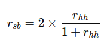

## QM-16-3 Split-Half-Reliability

### Beschreibung

Die Split-Half-Reliabilität wird berechnet, indem der Test in zwei Hälften geteilt wird, die Scores für diese beiden Hälften korreliert und dann mit der Spearman-Brown-Formel adjustiert werden, wobei  $r_(hh)$ die Korrelation zwischen den beiden Testhälften ist.

### Formel

Diese Koeffizienten geben einen Wert zwischen 0 und 1 aus, wobei höhere Werte auf eine höhere Reliabilität hinweisen. Die Wahl des spezifischen Reliabilitätsmaßes hängt von der Natur der Daten und dem Kontext der Untersuchung ab.

### Sourcecode "Split-Half-Reliability"
| RefID | Verweis                               |
| ----- | ------------------------------------- |
| 19    | QM-16-3_Split-Half-Reliability_python |

### Referenzen
| RefID | Verweis                                                                       | Kurzbeschr.                                                                                                                                                                                                                                                                                                                                                                                                                                        |
| ----- | ----------------------------------------------------------------------------- | -------------------------------------------------------------------------------------------------------------------------------------------------------------------------------------------------------------------------------------------------------------------------------------------------------------------------------------------------------------------------------------------------------------------------------------------------- |
| 111   |  Reliability (statistics)                                                     | In der Statistik und Psychometrie bezeichnet Reliabilität die Konsistenz einer Maßnahme, die als hoch gilt, wenn sie unter konsistenten Bedingungen ähnliche Ergebnisse liefert. Zuverlässigkeitskoeffizienten im Bereich von 0,00 (hoher Fehler) bis 1,00 (kein Fehler) geben den Grad der zufälligen Fehler im Messprozess an, wobei eine höhere Zuverlässigkeit präzisere und reproduzierbarere Ergebnisse bei wiederholten Tests widerspiegelt |
| 203   |  Split-half Reliabilität – eLearning - Methoden der Psychologie - TU Dresden  | Die Split-half Reliabilität bewertet die Zuverlässigkeit eines Tests, indem er in zwei Hälften geteilt und die Ergebnisse miteinander verglichen werden. Diese Methode vermeidet die Notwendigkeit eines zweiten Tests, kann aber Schwierigkeiten bei der Aufteilung verursachen.                                                                                                                                                                  |
| 239   |  Reliabilität                                                                 | Reliabilität ist ein zentrales Gütekriterium für wissenschaftliche Messungen und psychologische Tests, das die Genauigkeit und Reproduzierbarkeit von Messergebnissen beschreibt, indem es den Anteil der Varianz erklärt, der auf tatsächliche Merkmalsunterschiede und nicht auf Messfehler zurückzuführen ist.                                                                                                                                  |
