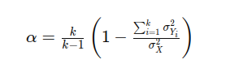

## QM-16-4 Cronbachsches Alpha

### Beschreibung

Eine häufig verwendete Metrik zur Berechnung der Reliability ist der Cronbachs Alpha (auch als Cronbachs Alpha-Koeffizient bekannt). Cronbachs Alpha ist eine Maßzahl für die interne Konsistenz von Messungen oder Testergebnissen und gibt an, wie eng die einzelnen Elemente eines Tests oder Fragebogens miteinander verbunden sind.

### Formel

- Cronsbachs Alpha für interne Konsistenz

Hierbei bedeuten:

- $l$ ist die Anzahl der Elemente im Test oder Fragebogen.
- $σ^2_(Y_i)$​ ist die Varianz des i-ten Elements.
- $σ^2_X​$ ist die Varianz der Gesamtwerte aller Elemente.

Eine hohe Cronbachs Alpha-Wert (typischerweise größer als 0,7 oder 0,8) deutet auf eine hohe interne Konsistenz der Messungen oder Testergebnisse hin, während ein niedriger Wert auf eine geringe interne Konsistenz hinweisen kann.

Es ist wichtig zu beachten, dass Cronbachs Alpha spezifisch für die interne Konsistenz ist und andere Aspekte der Reliability, wie z.B. Test-Retest-Reliabilität oder Inter-Rater-Reliabilität, möglicherweise mit anderen Metriken bewertet werden müssen. Die Auswahl der geeigneten Reliability-Metrik hängt von den spezifischen Anforderungen und Zielen der Analyse ab.

### Sourcecode "Cronsbach Alpha"
| RefID | Verweis                        |
| ----- | ------------------------------ |
| 20    | QM-16-4_Cronsbach Alpha_python |

### Referenzen
| RefID | Verweis                    | Kurzbeschr.                                                                                                                                                                                                                                                                                                                                                                                                                                        |
| ----- | -------------------------- | -------------------------------------------------------------------------------------------------------------------------------------------------------------------------------------------------------------------------------------------------------------------------------------------------------------------------------------------------------------------------------------------------------------------------------------------------- |
| 111   |  Reliability (statistics)  | In der Statistik und Psychometrie bezeichnet Reliabilität die Konsistenz einer Maßnahme, die als hoch gilt, wenn sie unter konsistenten Bedingungen ähnliche Ergebnisse liefert. Zuverlässigkeitskoeffizienten im Bereich von 0,00 (hoher Fehler) bis 1,00 (kein Fehler) geben den Grad der zufälligen Fehler im Messprozess an, wobei eine höhere Zuverlässigkeit präzisere und reproduzierbarere Ergebnisse bei wiederholten Tests widerspiegelt |
| 119   |  Cronbachsches Alpha       | Das Cronbachsche Alpha, benannt nach Lee Cronbach, misst die interne Konsistenz einer Skala, ohne deren Eindimensionalität zu bewerten, wird vor allem in den Sozialwissenschaften und der Psychologie zur Schätzung der Konsistenz psychometrischer Instrumente genutzt und in der neueren Literatur zunehmend durch den Begriff tau-äquivalente Reliabilität ersetzt.                                                                            |
| 239   |  Reliabilität              | Reliabilität ist ein zentrales Gütekriterium für wissenschaftliche Messungen und psychologische Tests, das die Genauigkeit und Reproduzierbarkeit von Messergebnissen beschreibt, indem es den Anteil der Varianz erklärt, der auf tatsächliche Merkmalsunterschiede und nicht auf Messfehler zurückzuführen ist.                                                                                                                                  |
