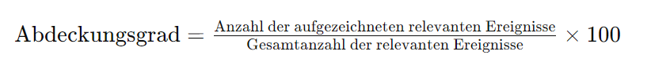

## QM-17 Abdeckungsgrad

### Beschreibung

Der Abdeckungsgrad bewertet, inwieweit die Audit-Trails alle erforderlichen Aktionen und Ereignisse aufzeichnen. Ein hoher Abdeckungsgrad bedeutet, dass wenige bis keine signifikanten Aktivitäten ohne Aufzeichnung bleiben. Der Abdeckungsgrad lässt sich nur schlecht definieren, da hier ein starker Use-Case-Fokus vorliegt. 

Der Abdeckungsgrad wird oft als Prozentsatz ausgedrückt, um eine intuitive Einschätzung der Vollständigkeit der Aufzeichnungen zu ermöglichen. Ein Wert von 100% würde bedeuten, dass alle relevanten Ereignisse lückenlos aufgezeichnet werden, während ein niedrigerer Wert darauf hinweist, dass bestimmte Aktionen oder Ereignisse nicht erfasst werden.

In der Praxis ist die exakte Bestimmung der „Gesamtanzahl der relevanten Ereignisse“ oft nicht trivial, da sie eine vollständige Kenntnis aller möglichen relevanten Aktionen voraussetzt und sich diese Anzahl in dynamischen Systemen ständig ändern kann. Daher ist es wichtig, den Fokus auf die kontinuierliche Verbesserung der Erfassungsmethoden und -werkzeuge zu legen und den Abdeckungsgrad regelmäßig zu überprüfen, um sicherzustellen, dass die Überwachungssysteme effektiv bleiben.

### Formel

### Beispiele 

#### 1. Automatisierung der Ereigniserfassung

- Beispiel: Implementierung automatisierter Audit-Trails in einem Unternehmensnetzwerk, die alle System- und Benutzeraktivitäten erfassen. Durch die Automatisierung wird sichergestellt, dass keine manuellen Fehler oder Auslassungen bei der Erfassung relevanter Ereignisse auftreten.
- Verbesserung: Der Abdeckungsgrad erhöht sich, da alle Aktionen automatisch protokolliert werden, ohne dass menschliches Versagen die Vollständigkeit der Daten beeinträchtigt.

#### 2. Integration neuer Überwachungstools

- Beispiel: Einführung eines neuen Überwachungstools, das in der Lage ist, nicht nur Netzwerkaktivitäten, sondern auch Aktivitäten auf Endgeräten wie Computern und Mobilgeräten zu überwachen.
- Verbesserung: Durch die erweiterte Abdeckung von mehr Systemen und Geräten steigt der Abdeckungsgrad, da mehr relevante Ereignisse erfasst werden.

#### 3. Regelmäßige Überprüfung und Aktualisierung der Audit-Richtlinien

- Beispiel: Durchführung von regelmäßigen Audits der bestehenden Richtlinien und deren Anpassung an neue Bedrohungen oder Compliance-Anforderungen.
- Verbesserung: Der Abdeckungsgrad wird verbessert, da die Überwachungsmaßnahmen stets auf dem neuesten Stand sind und alle aktuellen relevanten Ereignisse abdecken.

#### 4. Erhöhung der Sensitivität der Erfassungssysteme

- Beispiel: Anpassung der Einstellungen von Überwachungssystemen, um auch kleinere oder bisher unberücksichtigte Ereignisse zu erfassen, die bisher als irrelevant angesehen wurden.
- Verbesserung: Durch die Erfassung einer breiteren Palette von Ereignissen erhöht sich der Abdeckungsgrad, da auch weniger offensichtliche, aber potenziell relevante Aktivitäten überwacht werden.

#### 5. Schulung und Sensibilisierung des Personals

- Beispiel: Durchführung von Schulungen für IT- und Sicherheitspersonal, um die Bedeutung der vollständigen Ereigniserfassung und der Nutzung von Audit-Trails zu betonen.
- Verbesserung: Mit geschultem Personal, das die Bedeutung und Methodik der Ereigniserfassung versteht, wird die Wahrscheinlichkeit erhöht, dass alle relevanten Aktivitäten korrekt erfasst und dokumentiert werden, was den Abdeckungsgrad verbessert.

### Referenzen

| RefID | Verweis                                                        | Kurzbeschr.                                                                                                                                                                                                            |
| ----- | -------------------------------------------------------------- | ---------------------------------------------------------------------------------------------------------------------------------------------------------------------------------------------------------------------- |
| 36    |  ISO/IEC 27001:2022 - Information security management systems  | Während dieser Standard primär auf Informationssicherheitsmanagement abzielt, enthält er auch Bestimmungen zur Sicherstellung der Integrität und Vertraulichkeit von Daten, die für Trainingsdaten von Bedeutung sind. |
