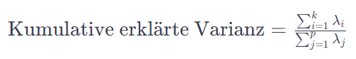

## QM-21 Kumulative erklärte Varianz

### Beschreibung

Die kumulative erklärte Varianz bezieht sich auf die Gesamtmenge der Variation in den Daten, die durch eine bestimmte Anzahl von Variablen oder Faktoren erklärt werden.

In der Dimensionsreduktion bezieht sich diese auf die Summe der Varianzen der Hauptkomponenten. Durch die Summe der Varianzen der Hauptkomponenten wird die Entscheidung getroffen mit einer plausiblen Gesamtsumme die passende Anzahl an Hauptkomponenten zu ermitteln. Sie wird also verwendet, um zu entscheiden, wie viele Hauptkomponenten behalten werden sollen, um die Daten angemessen zu repräsentieren.

Ein typisches Ziel ist es, eine hohe kumulative erklärte Varianz zu erreichen, um einen Großteil der Variation in den Daten zu erfassen. Die Wahl der Anzahl der Variablen oder Hauptkomponenten in der kumulativen Varianz hängt von den Analyseanforderungen ab.

### Formel

Lambda: Eigenwerte der i-ten Hauptkomponente. k ausgewählte Anzahl der Hauptkomponenten 

- **$\lambda_i$**: Der Eigenwert der $i$-ten Hauptkomponente.
- **$k$**: Die Anzahl der betrachteten Hauptkomponenten.
- **$p$**: Die Gesamtanzahl der Hauptkomponenten.

### Beispiele - Iris Datensatz - Kumulative erklärte Varianz 

Ein Beispiel für die kumulative erklärte Varianz auf dem Iris-Datensatz zeigt:

| Principal Component | Verhältnis Erkl. Varianz | Kumulative Erkl. Varianz |
| ------------------- | ------------------------ | ------------------------ |
| 1                   | 0.924618                 | 0.924618                 |
| 2                   | 0.053066                 | 0.977685                 |
| 3                   | 0.017102                 | 0.994787                 |
| 4                   | 0.005213                 | 1.000000                 |

#### Interpretation:

- Erste Hauptkomponente: Die erste Hauptkomponente erklärt etwa 92,46% der Gesamtvarianz im Datensatz. Das bedeutet, dass diese Komponente die meisten wichtigen Informationen enthält.
- Zweite Hauptkomponente: Die zweite Hauptkomponente erklärt zusätzlich 5,31% der Varianz. Zusammen mit der ersten Komponente erklären sie etwa 97,77% der Varianz.
- Dritte und vierte Hauptkomponente: Die dritte und vierte Hauptkomponente tragen nur minimal zur erklärten Varianz bei, nämlich 1,71% bzw. 0,52%. 

Dies zeigt, dass die meisten Informationen im Iris-Datensatz durch die ersten beiden Hauptkomponenten erfasst werden können. Ein Scree-Plot, der die kumulative erklärte Varianz zeigt, wurde ebenfalls erstellt, um dies zu veranschaulichen.

### Referenzen

| RefID | Verweis                   | Kurzbeschr.                                                                                                                                                                                                                                                                                                                                                                    |
| ----- | ------------------------- | ------------------------------------------------------------------------------------------------------------------------------------------------------------------------------------------------------------------------------------------------------------------------------------------------------------------------------------------------------------------------------ |
| 115   |  Hauptkomponentenanalyse  | Die Hauptkomponentenanalyse (HKA) ist ein Verfahren der multivariaten Statistik, das große Datensätze durch Eigenvektoren der Kovarianzmatrix vereinfacht, indem viele Variablen zu wenigen aussagekräftigen Hauptkomponenten zusammengefasst werden. Sie findet Anwendung unter anderem in der Signal- und Bildverarbeitung und ist von der Faktorenanalyse zu unterscheiden. |
