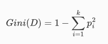
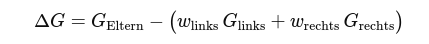

## QM-26 Gini-Importance-Score

### Beschreibung

Der Gini Importance Score, auch bekannt als "Mean Decrease in Impurity" (MDI), misst die Bedeutung eines Features in Modellen wie Entscheidungsbäumen oder Random Forests. Dieser Score zeigt an, wie viel ein Feature zur Reduktion der Gini-Impurity beiträgt, wenn es verwendet wird, um die Daten in den Knoten eines Entscheidungsbaums zu splitten. Ein höherer Gini Importance Score bedeutet, dass das Feature häufiger verwendet wird und mehr zur Reduzierung der Ungleichheit in den resultierenden Kindknoten beiträgt.

### Methode

- Gini-Impurity eines Knotens:

$p_i$ : Klassenwahrscheinlichkeit des betrachteten Knotens 

Das Ergebnis gibt an, wie „gemischt“ die Klassen im Knoten sind (0 = rein).

- Beitrag eines Splits:

- Dabei sind $w$ die Anteile der Stichproben in den Teilknoten.

- Feature-Wichtigkeit:
Über alle Bäume und Splits hinweg werden die einzelnen ΔG eines Features aufsummiert (und bei Bedarf normalisiert). Ein hoher Wert bedeutet, dass das Merkmal oft und wirkungsvoll zur Klassentrennung beiträgt.

### Sourcecode "Gini Importance Score"

| RefID | Verweis                            |
| ----- | ---------------------------------- |
| 25    | QM-26_Gini Importance Score_python |

### Referenzen

| RefID | Verweis                                                                        | Kurzbeschr.                                                                                                                                                                                                                                                                                                                                                                                                                                                |
| ----- | ------------------------------------------------------------------------------ | ---------------------------------------------------------------------------------------------------------------------------------------------------------------------------------------------------------------------------------------------------------------------------------------------------------------------------------------------------------------------------------------------------------------------------------------------------------- |
| 180   |  The elements of statistical learning: data mining, inference, and prediction  | Dieses Buch bietet einen umfassenden Überblick über Schlüsselkonzepte des Data Mining in Bereichen wie Medizin und Finanzen und konzentriert sich dabei auf überwachtes und unüberwachtes Lernen. Es behandelt Themen wie neuronale Netze, Boosting und fügt neue Inhalte zu Random Forests, Ensemble-Methoden und dem Umgang mit „großen“ Daten hinzu. Es ist nützlich für Statistiker und diejenigen, die in der Wissenschaft oder Industrie tätig sind. |

