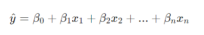
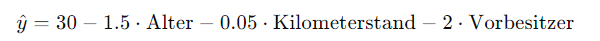
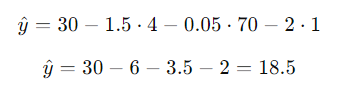

## QM-28 Koeffizienten linearer Modelle

### Beschreibung

In linearen Regressions- oder Logistikregressionsmodellen sind die Koeffizienten der Merkmale direkt mit ihrer Wichtigkeit verbunden. Größere Koeffizienten deuten auf eine größere Wichtigkeit hin.

### Formel

Hierbei steht $hat y$​ für die geschätzte abhängige Variable, $ß_0$​ für den y-Achsenabschnitt (auch bekannt als Bias oder Intercept) und $ß_1$,$ß_2$​,...,$ß_n$​ für die Koeffizienten der unabhängigen Variablen $x_1$​,$x_2$​,...,$x_n$​.

### Beispiele 

#### Beispiel - Preisvorhersage für Autos

Ein Datensatz mit den folgenden Merkmalen, um den Preis eines Autos vorherzusagen:

- Alter des Autos (Jahre)
- Kilometerstand des Autos (in Tausend Kilometer)
- Anzahl der Vorbesitzer

Das Ziel ist es, den Preis des Autos (in Tausend Euro) basierend auf diesen Merkmalen zu schätzen.

####  Vorgehensweise

- **Datensatz erstellen:**

|Alter (Jahre)|Kilometerstand (Tausend km)|Vorbesitzer|Preis (Tausend Euro)|
|---|---|---|---|
|3|40|1|22|
|5|80|2|15|
|2|30|1|25|
|8|120|3|8|
|4|70|1|18|

- **Lineares Modell trainieren:**

Nach dem Training eines lineares Regressionsmodell auf diesem Datensatz erhält man die folgenden Koeffizienten:
- Intercept (Achsenabschnitt) $beta_0$ = 30
- Koeffizient für Alter $β_1$ = -1.5
- Koeffizient für Kilometerstand $β_2$ = -0.05
- Koeffizient für Vorbesitzer $beta_3$= -2

- Formel für die Preisvorhersage:

Basierend auf diesen Koeffizienten lautet die lineare Gleichung zur Vorhersage des Autopreises:

- Beispiel für Vorhersagen:

Angenommen, wir möchten den Preis eines Autos vorhersagen, das 4 Jahre alt ist, 70.000 km gefahren ist und einen Vorbesitzer hatte:

Das Modell schätzt den Preis des Autos auf 18500 Euro.

#### Erklärung der Koeffizienten:

- Intercept (30): Dies ist der geschätzte Preis eines Autos, wenn alle Merkmale (Alter, Kilometerstand, Vorbesitzer) null sind. In diesem Beispiel wäre dies der hypothetische Preis eines brandneuen Autos ohne Kilometerstand und ohne Vorbesitzer.
    
- Koeffizient für Alter (-1.5): Für jedes weitere Jahr des Alters des Autos sinkt der geschätzte Preis um 1500 Euro.
    
- Koeffizient für Kilometerstand (-0.05): Für jeden zusätzlichen Tausend Kilometer, die das Auto gefahren ist, sinkt der geschätzte Preis um 50 Euro.
    
- Koeffizient für Vorbesitzer (-2): Für jeden zusätzlichen Vorbesitzer sinkt der geschätzte Preis um 2000 Euro.
    
Dieses Beispiel zeigt, wie die Koeffizienten in einem linearen Modell verwendet werden, um die Beziehung zwischen Merkmalen und Zielvariablen zu erklären und Vorhersagen zu treffen.

### Referenzen

| RefID | Verweis                                      | Kurzbeschr.                                                                                                                                               |
| ----- | -------------------------------------------- | --------------------------------------------------------------------------------------------------------------------------------------------------------- |
| 201   |  Statistics for Applications \| Mathematics  | Der Kurs vermittelt eine vertiefte theoretische Basis statistischer Methoden und beleuchtet die Rolle der Mathematik bei deren Forschung und Entwicklung. |

