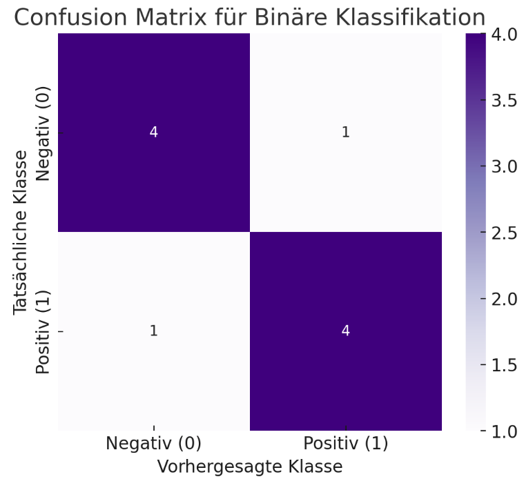

## QM-35 Konfusionsmatrix

### Beschreibung

Eine Tabelle, die die Anzahl der korrekten und falschen Vorhersagen detailliert aufschlüsselt, gegliedert nach tatsächlichen Kategorien und Vorhersagekategorien. Sie bietet einen umfassenden Überblick darüber, wie gut das Modell funktioniert.

### Methode

Die Confusion Matrix für die binäre Klassifikation zeigt die Anzahl der True Positives, True Negatives, False Positives und False Negatives. Diese Matrix hilft dabei, die Leistung eines Klassifizierungsmodells zu visualisieren, indem sie darstellt, wie oft die Vorhersagen mit den tatsächlichen Werten übereinstimmen oder davon abweichen.

### Beispiele 

#### Beispiel 1

das Vorhandensein einer Krankheit wird anhand medizinischer Tests vorhergesagt. Die Daten umfassen 100 Patienten, die entweder positiv (krank) oder negativ (nicht krank) sind.

- **True Positives (TP)**: 40 Patienten wurden korrekt als krank diagnostiziert.
- **True Negatives (TN)**: 50 Patienten wurden korrekt als nicht krank diagnostiziert.
- **False Positives (FP)**: 5 Patienten wurden fälschlicherweise als krank diagnostiziert, obwohl sie gesund sind.
- **False Negatives (FN)**: 5 Patienten wurden fälschlicherweise als gesund diagnostiziert, obwohl sie krank sind.

| |Vorhergesagt: Krank|Vorhergesagt: Gesund|
|---|---|---|
|**Tatsächlich: Krank**|40|5|
|**Tatsächlich: Gesund**|5|50|

### Referenzen

| RefID | Verweis                                                                                                                               | Kurzbeschr.                                                                                                                                                                                                                                                                                                                                                   |
| ----- | ------------------------------------------------------------------------------------------------------------------------------------- | ------------------------------------------------------------------------------------------------------------------------------------------------------------------------------------------------------------------------------------------------------------------------------------------------------------------------------------------------------------- |
| 250   |  Confusion matrix                                                                                                                     | Eine Konfusionsmatrix ist eine Tabelle, die im überwachten Lernen verwendet wird, um die Leistung eines Algorithmus zu bewerten, indem tatsächliche und vorhergesagte Klassen verglichen werden. Dabei repräsentiert die Diagonale die korrekten Vorhersagen und die Einträge außerhalb der Diagonale heben Fehlklassifikationen zwischen den Klassen hervor. |
| 276   |  ISO/IEC TS 4213:2022 - Information technology — Artificial intelligence — Assessment of machine learning classification performance  | Information technology — Artificial intelligence — Assessment of machine learning classification performance                                                                                                                                                                                                                                                  |
