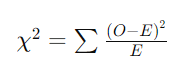

## QM-40 Chi-Quadrat Test

### Beschreibung

Der Chi-Quadrat-Test ist ein statistisches Verfahren, das bei Variablen mit nominalem oder ordinalem Skalenniveau eingesetzt wird. Er wird verwendet, um zu überprüfen, ob beobachtete Häufigkeiten von den erwarteten Häufigkeiten abweichen (Anpassungstest) oder ob ein Zusammenhang zwischen zwei nominal skalierten Variablen besteht (Unabhängigkeitstest).

### Formel

- χ2 für den Chi-Quadrat-Wert,
-  O für die beobachteten Häufigkeiten in den Daten,
- E für die erwarteten Häufigkeiten unter der Nullhypothese, dass keine Assoziation zwischen den Kategorien besteht

### Pythoncode "Chi-Quadrat Test"

| RefID | Verweis                       |
| ----- | ----------------------------- |
| 33    | QM-40_Chi-Quadrat Test_python |

### Referenzen

| RefID | Verweis                                                         | Kurzbeschr.                                                                                                                                                                                                                                                                                                                                                                                                                                 |
| ----- | --------------------------------------------------------------- | ------------------------------------------------------------------------------------------------------------------------------------------------------------------------------------------------------------------------------------------------------------------------------------------------------------------------------------------------------------------------------------------------------------------------------------------- |
| 194   |  Statistik für Human- und Sozialwissenschaftler: extras online  | Das Lehrbuch bietet eine klare Einführung in die Statistik mit Beispielen und Übungen, besonders aus der Psychologie. Die 7. Auflage verbessert die Verständlichkeit und bietet eine neue Website mit SPSS-Anleitungen, Lerntools und Lehrmaterialien.                                                                                                                                                                                      |
| 217   |  Introduction to Probability and Statistics \| Mathematics      | Der MIT-Kurs Introduction to Probability and Statistics bietet eine grundlegende Einführung in Wahrscheinlichkeitstheorie und Statistik, behandelt Themen wie Kombinatorik, Zufallsvariablen, Wahrscheinlichkeitsverteilungen, Bayessche Inferenz, Hypothesentests, Konfidenzintervalle und lineare Regression und ermöglicht durch interaktive Materialien in der Open Learning Library eine praxisorientierte und flexible Lernerfahrung. |

