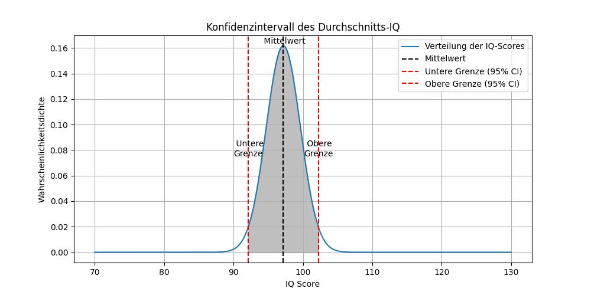
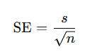

## QM-41 Konfidenz-Intervall

### Beschreibung

Ein Konfidenzintervall (KI) ist ein statistisches Maß, um die Unsicherheit um einen Schätzwert herum zu beschreiben. Es ist ein Intervall von Werten, innerhalb dessen man mit einer bestimmten Wahrscheinlichkeit (dem Konfidenzniveau) davon ausgehen kann, dass es den wahren Parameterwert enthält.

  
Diese Grafik stellt das Konfidenzintervall des Durchschnitts-IQ in Form einer Glockenkurve dar, die eine normale Verteilung der IQ-Werte in der Bevölkerung repräsentiert. Sie lässt sich wie folgt beschreiben:

- Verteilung der IQ-Werte: Die blaue Kurve zeigt die Wahrscheinlichkeitsdichte für die IQ-Werte. Es handelt sich um eine Normalverteilung, auch bekannt als Glockenkurve, was bedeutet, dass die meisten IQ-Werte um den Mittelwert herum liegen und die Anzahl der Personen mit extrem hohen oder niedrigen Werten geringer ist.
    
- Mittelwert: Die gestrichelte schwarze Linie markiert den Mittelwert der IQ-Werte. In dieser Grafik liegt der Mittelwert bei etwa 100, was für IQ-Tests üblich ist.
    
- Untere Grenze (95% KI): Die untere rote, gestrichelte Linie zeigt die untere Grenze des 95%-Konfidenzintervalls. Das Konfidenzintervall gibt an, mit welcher Sicherheit (hier 95%) der wahre Mittelwert der Population innerhalb dieses Bereichs liegt. In diesem Fall liegt die untere Grenze bei etwa 85.
    
- Obere Grenze (95% CI): Entsprechend zeigt die obere rote, gestrichelte Linie die obere Grenze des 95%-Konfidenzintervalls. Hier ist die obere Grenze bei etwa 115.
    
- Konfidenzintervall des Durchschnitts-IQ: Das Intervall zwischen den beiden roten Linien ist das 95%-Konfidenzintervall. Es bedeutet, dass man mit 95%iger Sicherheit davon ausgehen kann, dass der wahre Durchschnitts-IQ der Gesamtbevölkerung innerhalb dieses Bereichs liegt.
    
- Achsenbeschriftungen: Die x-Achse zeigt die IQ-Scores, während die y-Achse die Wahrscheinlichkeitsdichte angibt. Eine höhere Wahrscheinlichkeitsdichte bedeutet, dass mehr Personen einen IQ-Wert in diesem Bereich haben.
    

Insgesamt zeigt die Grafik, dass IQ-Werte in der Bevölkerung normal verteilt sind, mit einem Mittelwert von 100 und einem 95%-Konfidenzintervall von etwa 85 bis 115. Das Konfidenzintervall wird verwendet, um die Genauigkeit einer Schätzung anzugeben, und hier sagt es uns, dass wir ziemlich sicher sein können, dass der wahre Mittelwert des IQs in der Population innerhalb dieses Bereichs liegt.

### Methode

Die Berechnung des Konfidenzintervalls erfolgt in den folgenden Schritten:

- **Mittelwert der Stichprobe berechnen**: Bestimme den Mittelwert $bar x$ der Stichprobendaten.
- **Standardabweichung der Stichprobe berechnen**: Berechne die Standardabweichung (\(s\)) der Stichprobendaten.
- **Standardfehler berechnen**: Teile die Standardabweichung durch die Quadratwurzel der Stichprobengröße $(n)$: **Z- oder t-Wert finden**: Bestimme den Z- oder t-Wert für das gewünschte Konfidenzniveau (z.B. 1,96 für 95% bei normalverteilter Population)

- **Konfidenzintervall berechnen**: 
   - Untere Grenze: $\bar{x} - (Z \text{ oder } t \cdot \text{SE})$
   - Obere Grenze: $\bar{x} + (Z \text{ oder } t \cdot \text{SE}).$

### Pythoncode "Konfidenz-Intervalle"

| RefID | Verweis                          |
| ----- | -------------------------------- |
| 34    | QM-41_KonfidenzIntervalle_python |

### Referenzen

| RefID | Verweis              | Kurzbeschr.                                                                                                                                                                                                                                                                                                                                            |
| ----- | -------------------- | ------------------------------------------------------------------------------------------------------------------------------------------------------------------------------------------------------------------------------------------------------------------------------------------------------------------------------------------------------ |
| 240   |  Konfidenzintervall  | Ein Konfidenzintervall ist ein in der frequentistischen Statistik genutzter Wertebereich, der mit einer bestimmten Wahrscheinlichkeit (z. B. 95 %) den wahren Parameter einer Verteilung einschließt und die Präzision der Schätzung angibt, wobei diese Wahrscheinlichkeit eine Eigenschaft des Schätzverfahrens und nicht des Intervalls selbst ist. |

