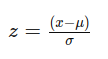

## QM-46 Daten-Standardisierung

### Beschreibung

Standardisierung im Bereich des maschinellen Lernens ist ein wichtiger Schritt der Datenvorverarbeitung, der darauf abzielt die Daten für Algorithmen besser verarbeitbar zu machen. Hierbei geht es darum, die Daten so zu transformieren, dass sie einheitliche Eigenschaften aufweisen, was in der Regel bedeutet, dass sie einen Mittelwert von Null und eine Standardabweichung von Eins haben. Hier sind einige Punkte, die die Bedeutung und den Nutzen der Standardisierung in Machine Learning verdeutlichen:

- Vereinheitlichung der Maßstäbe: Verschiedene Merkmale (Features) in einem Datensatz können in verschiedenen Einheiten und Maßstäben vorliegen (z. B. Kilogramm, Meter, Jahre). Standardisierung hilft, alle Merkmale auf denselben Maßstab zu bringen, wodurch Algorithmen effektiver arbeiten können.
- Verbesserung der Konvergenz: Viele Machine-Learning-Algorithmen, insbesondere solche, die Gradientenabstieg verwenden (wie lineare und logistische Regression), konvergieren schneller, wenn die Eingabedaten standardisiert sind. Unterschiedliche Maßstäbe bei den Merkmalen können dazu führen, dass der Optimierungsalgorithmus langsamer oder ungleichmäßig konvergiert.
- Vereinfachung des Lernprozesses: Bei standardisierten Daten ist es oft einfacher, die Hyperparameter der Modelle zu wählen und anzupassen, da die Eigenschaften der Daten konsistenter sind.
- Bessere Performance: Einige Algorithmen, wie Support Vector Machines (SVMs) und k-nearest neighbors (KNN), sind sehr sensitiv gegenüber der Skalierung der Eingabedaten. Standardisierte Daten können zu einer verbesserten Modellgenauigkeit und Performance führen.

### Formel

Die Standardisierung erfolgt typischerweise, indem man von jedem Merkmalswert den Mittelwert der entsprechenden Merkmalsausprägung abzieht und das Ergebnis durch die Standardabweichung teilt:

wo $x$ der ursprüngliche Wert des Merkmals ist,  $mu$ der Mittelwert und $sigma$ die Standardabweichung. Durch diesen Vorgang werden die Merkmale so skaliert, dass sie um den Mittelwert Null mit einer Standardabweichung von Eins zentriert sind.

### Pythoncode "Daten Standardisierung"

| RefID | Verweis                        |
| ----- | ------------------------------ |
| 45    | QM-46_DataStandardizing_python |

### Referenzen

| RefID | Verweis                        | Kurzbeschr.                                                                                                                                                                                                                                                               |
| ----- | ------------------------------ | ------------------------------------------------------------------------------------------------------------------------------------------------------------------------------------------------------------------------------------------------------------------------- |
| 267   |  Standardisierung (Statistik)  | In der mathematischen Statistik bezeichnet Standardisierung die lineare Transformation einer Zufallsvariable durch Subtraktion ihres Erwartungswerts und Division durch ihre Standardabweichung, sodass die resultierende Variable Erwartungswert 0 und Varianz 1 besitzt |

