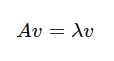
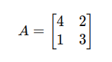
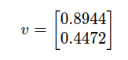

## QM-48 Eigenvektoren

### Beschreibung

Ein Eigenvektor ist ein Vektor, der bei der Anwendung einer linearen Transformation oder Matrix auf sich selbst nicht seine Richtung ändert, sondern nur skaliert wird. Der Faktor, mit dem der Eigenvektor skaliert wird, ist der zugehörige Eigenwert. Mathematisch ausgedrückt: Wenn ( A ) eine Matrix und ( v ) ein Eigenvektor ist, dann gilt:

Hierbei ist $lambda$ der Eigenwert, der mit dem Eigenvektor $v$ assoziiert ist. Diese Beziehung zeigt, dass die Wirkung von $A$ auf $v$ lediglich darin besteht, $v$ um den Faktor $lambda$ zu strecken oder zu stauchen. Eigenvektoren und Eigenwerte spielen eine zentrale Rolle in vielen Bereichen der Mathematik und Technik, einschließlich der Stabilitätsanalyse, Optimierung und Systemtheorie.

Bei der PCA repräsentieren die Eigenwerte die Varianz, die von jeder Hauptkomponente aufgenommen wird. Ein hoher Eigenwert bedeutet, dass die entsprechende Hauptkomponente einen großen Teil der Gesamtvarianz in den Daten erklärt.

### Methode 

- **Matrix bereitstellen**: Man beginnt mit einer quadratischen Matrix, die die Transformation darstellt.
- **Eigenwerte finden**: Zuerst berechnet man die Eigenwerte, die mit den Eigenvektoren verknüpft sind. Das sind spezielle Zahlen, die beschreiben, wie stark der Vektor gestreckt oder gestaucht wird.
- **Eigenvektoren berechnen**: Für jeden Eigenwert bestimmt man den Eigenvektor, indem man ein Gleichungssystem löst. Der Eigenvektor ist der Vektor, der durch die Transformation seine Richtung beibehält.
- **Eigenvektor normalisieren (optional)**: Man kann den Eigenvektor auf eine Länge von 1 bringen, indem man ihn durch seine Länge teilt. Das ist aber nicht immer notwendig.

### Beispiele 

#### Beispiel 1

Gegeben sei die Matrix A wie oben definiert.:

$v$ ist ein Eigenvektor:

mit dem zugehörigen Eigenwert $lambda$=5. Das bedeutet, wenn wir die Matrix $A$ auf diesen Vektor anwenden, wird er um den Faktor 5 gestreckt, ohne seine Richtung zu ändern. ​

### Pythoncode "Eigenwerte"
| RefID | Verweis                          |
| ----- | -------------------------------- |
| 47    | QM-48_Eigenwerte_Vektoren_python |

### Referenzen
| RefID | Verweis                        | Kurzbeschr.                                                                                                                                                                                                                                       |
| ----- | ------------------------------ | ------------------------------------------------------------------------------------------------------------------------------------------------------------------------------------------------------------------------------------------------- |
| 242   |  Eigenwerte und Eigenvektoren  | Ein Eigenvektor ist ein Vektor, dessen Richtung unter einer linearen Abbildung unverändert bleibt, wobei der Skalierungsfaktor als Eigenwert bezeichnet wird, der zentrale Eigenschaften der Abbildung und physikalische Modelle charakterisiert. |

