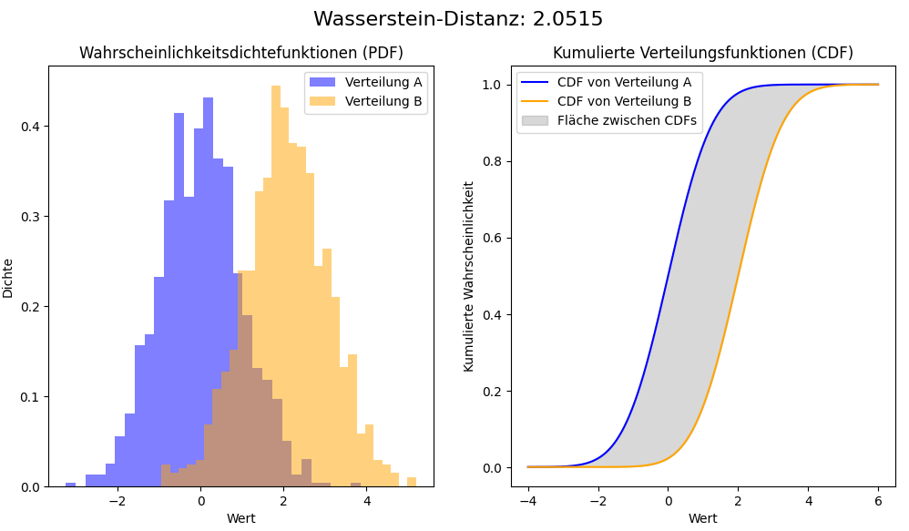

## QM-49 Wasserstein-Distanz

### Beschreibung

Die Wasserstein-Distanz (auch EMD - Earth Mover's Distance) ist ein Maß für die Distanz zwischen zwei Wahrscheinlichkeitsverteilungen über einem gegebenen Raum. Eingesetzt in der Bildverarbeitung, im maschinellen Lernen und in der statistischen Analyse misst sie die Unterschiede zwischen zwei verschiedenen Verteilungen. 

- Anschauliche Interpretation: 
Die Distanz ist die minimale "Arbeit", die benötigt wird um einen "Haufen Erde" (die Wahrscheinlichkeitsverteilung) in die Form eines anderen Haufens zu bringen (die andere Verteilung).

### Methode

Die Wasserstein-Distanz misst, wie viel Aufwand nötig ist, um eine Verteilung in eine andere umzuwandeln. Dabei geht es darum, Masse von einer Verteilung zur anderen zu "transportieren", wobei die Transportkosten von der Entfernung der Punkte abhängen.

- **Verteilungen definieren:** Man hat zwei Verteilungen und will herausfinden, wie viel es kostet, eine in die andere zu überführen.
- **Transportproblem aufstellen:** Man bestimmt, wie viel Masse von einem Punkt der ersten Verteilung zu einem Punkt der zweiten verschoben wird.
	- **Optimierung:** Man findet die Lösung, bei der die Transportkosten minimal sind.
- **Lineare Optimierung:** Bei diskreten Verteilungen löst man das Problem mit Optimierungsmethoden wie dem Simplex-Algorithmus.
- **Numerische Ansätze:** Für kontinuierliche Verteilungen nutzt man oft Näherungsverfahren wie den Sinkhorn-Algorithmus.

Am Ende erhält man die minimale Transportarbeit als die Wasserstein-Distanz.
- Die Wasserstein-Distanz ist immer positiv.
- Es gibt keinen festen oberen Grenzwert; der maximale Wert hängt vom zugrundeliegenden metrischen Raum ab.

#### Interpretation der Werte

- **0**: Identische Verteilungen
- **Kleine Werte**: Ähnliche Verteilungen
- **Große Werte**: Stark unterschiedliche Verteilungen

Die Interpretation ist stark vom spezifischen Anwendungskontext abhängig:
- **Skalenabhängigkeit**: Der absolute Wert hängt von der Skala des metrischen Raums ab.
- **Problemspezifik**: Was als "groß" oder "klein" gilt, variiert je nach Anwendungsgebiet.

Oft ist es hilfreich, die Wasserstein-Distanz relativ zu anderen Werten zu interpretieren:
- Vergleich mit Distanzen zwischen anderen Verteilungspaaren im gleichen Kontext.
- Betrachtung der Veränderung der Distanz über Zeit oder verschiedene Szenarien.

### Beispiel - Wasserstein Distanz

### Pythoncode "Wasserstein Distance"

| RefID | Verweis                           |
| ----- | --------------------------------- |
| 48    | QM-49_Wasserstein Distance_python |

### Referenzen

| RefID | Verweis              | Kurzbeschr.                                                                                                                                                                                                                            |
| ----- | -------------------- | -------------------------------------------------------------------------------------------------------------------------------------------------------------------------------------------------------------------------------------- |
| 238   |  Wasserstein-Metrik  | Die Wasserstein-Metrik, auch bekannt als Earth-Mover’s-Metrik, misst die minimalen Kosten der Umwandlung einer Wahrscheinlichkeitsverteilung in eine andere auf einem metrischen Raum und wurde 1969 von Leonid Vaseršteĭn eingeführt. |

