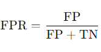
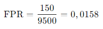

## QM-33 Anzahl falsch positiver Ergebnisse

### Beschreibung

Diese Metrik betrachtet das Verhältnis der "falsch positiven" Ergebnisse im Verhältnis zu allen tatsächlich "negativen" Ergebnissen. Die Anzahl der tatsächlich negativen Fälle enthält die korrekt als negativ detektierten sowie die als falsch positiv detektierten Fälle. 

### Formel

- FP (False Positives): Die Anzahl der negativen Instanzen, die fälschlicherweise als positiv klassifiziert wurden.
- TN (True Negatives): Die Anzahl der negativen Instanzen, die korrekt als negativ klassifiziert wurden.

### Beispiel - Spam-Filter für E-Mails

Ein Unternehmen hat ein automatisches Spam-Filter-System implementiert, das E-Mails als "Spam" (Positiv) oder "Nicht-Spam" (Negativ) klassifiziert. Das Unternehmen erhält 10000 E-Mails im Monat.

- Positive Klasse (P): E-Mails, die tatsächlich Spam sind. 150
- Negative Klasse (N): E-Mails, die tatsächlich kein Spam sind. 9500
- False Positives (FP): E-Mails, die fälschlicherweise als Spam klassifiziert werden, obwohl sie kein Spam sind.

Die False Positive Rate beträgt 0,0158 oder 1,58 %. Das bedeutet, dass der Spamfilter in 1,58 % der Fälle legitime E-Mails fälschlicherweise als Spam markiert.

### Referenzen

| RefID | Verweis                               | Kurzbeschr.                                                                                                                                                              |
| ----- | ------------------------------------- | ------------------------------------------------------------------------------------------------------------------------------------------------------------------------ |
| 218   |  False positives and false negatives  | Ein False Positive liegt vor, wenn ein Test fälschlich das Vorhandensein einer Bedingung signalisiert, ein False Negative, wenn er fälschlich deren Abwesenheit anzeigt; |

