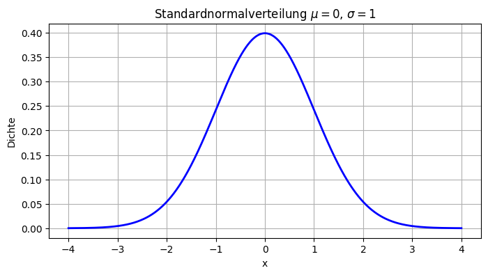
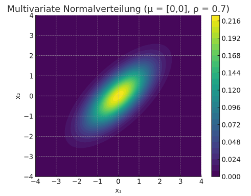

## QM-51-1 Normalverteilung

### Beschreibung

#### Univariate Normalverteilung

Eine Normalverteilung, auch als Gauß-Verteilung bezeichnet, ist eine spezielle Art der Wahrscheinlichkeitsverteilung, bei der die Daten um den Mittelwert herum symmetrisch angeordnet sind. In einer Normalverteilung sind die meisten Daten nahe dem Mittelwert konzentriert und die Verteilung hat einen charakteristischen Glockenkurvenverlauf.

#### Multivariate Normalverteilung

Die multivariate Normalverteilung ist eine Erweiterung der Normalverteilung auf mehrere Zufallsvariablen. Sie modelliert **mehrdimensionale, kontinuierliche Daten**, bei denen die Variablen **korreliert** sein können. Die Verteilung ist durch einen **Mittelwertvektor** und eine **Kovarianzmatrix** vollständig bestimmt. Ihre Dichte weist **elliptische Konturen** auf, wobei Form und Orientierung durch die Kovarianzstruktur bestimmt werden.

- Die **elliptischen Konturen** zeigen die Dichteverteilung.
- Die Hauptachse der Ellipsen ist **geneigt**, was die **Korrelation** zwischen den beiden Variablen widerspiegelt.
- Hohe Dichte (helle Bereiche) liegt in der Mitte beim Mittelwert μ=[0,0], die Dichte nimmt radial ab.

### Sourcecode "Normalverteilung"

| RefID | Verweis                         |
| ----- | ------------------------------- |
| 50    | QM-51-1_Normalverteilung_python |

### Referenzen

| RefID | Verweis                                                     | Kurzbeschr.                                                                                                                                                                                                                                                                                                                                                                                                                                 |
| ----- | ----------------------------------------------------------- | ------------------------------------------------------------------------------------------------------------------------------------------------------------------------------------------------------------------------------------------------------------------------------------------------------------------------------------------------------------------------------------------------------------------------------------------- |
| 217   |  Introduction to Probability and Statistics \| Mathematics  | Der MIT-Kurs Introduction to Probability and Statistics bietet eine grundlegende Einführung in Wahrscheinlichkeitstheorie und Statistik, behandelt Themen wie Kombinatorik, Zufallsvariablen, Wahrscheinlichkeitsverteilungen, Bayessche Inferenz, Hypothesentests, Konfidenzintervalle und lineare Regression und ermöglicht durch interaktive Materialien in der Open Learning Library eine praxisorientierte und flexible Lernerfahrung. |

