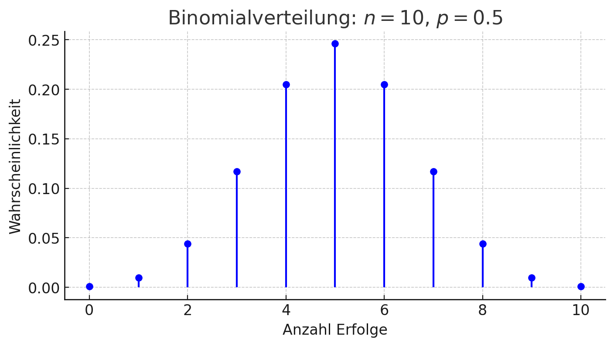

## QM-51-2 Binomialverteilung

### Beschreibung

Die Binomialverteilung ist eine diskrete Wahrscheinlichkeitsverteilung, die verwendet wird, um die Anzahl der Erfolge in einer festgelegten Anzahl von unabhängigen Bernoulli-Experimenten zu modellieren. Jedes Experiment hat zwei mögliche Ergebnisse: Erfolg oder Misserfolg.

Die Darstellung der Binomialverteilung mit den Parametern n=10 (Anzahl der Versuche) und p=0.5 (Wahrscheinlichkeit des Erfolgs pro Versuch). Die Grafik zeigt die Wahrscheinlichkeitsdichtefunktion, wobei auf der x-Achse die mögliche Anzahl von Erfolgen und auf der y-Achse die entsprechenden Wahrscheinlichkeiten abgebildet sind. Jeder Punkt gibt die Wahrscheinlichkeit an, genau diese Anzahl von Erfolgen in 10 Versuchen zu erreichen, wenn die Erfolgswahrscheinlichkeit bei jedem Versuch 50 % beträgt. ​

### Beispiele 

#### Beispiel 1

Angenommen, man wirft eine Münze 10 Mal, und die Wahrscheinlichkeit, dass die Münze auf „Kopf“ landet, ist p=0.5. Man möchte die Wahrscheinlichkeit berechnen, dass genau 6 Mal „Kopf“ erscheint.

- Anzahl der Versuche (n): 10
- Wahrscheinlichkeit für Erfolg („Kopf“) (p): 0.5
- Anzahl der Erfolge (k): 6

Die Wahrscheinlichkeit, genau 6 Mal „Kopf“ zu bekommen, lässt sich mit der Binomialverteilung berechnen. 

#### Beispiel 2

Ein Unternehmen produziert Glühbirnen, und die Wahrscheinlichkeit, dass eine Glühbirne defekt ist, beträgt 5 % (also p=0,05). Ein Inspektor überprüft 20 Glühbirnen und möchte wissen, wie wahrscheinlich es ist, dass genau 2 davon defekt sind.

- Anzahl der Versuche (n): 20
- Wahrscheinlichkeit für einen defekten Artikel (p): 0.05
- Anzahl der defekten Glühbirnen (k): 2

Auch hier wird die Binomialverteilung verwendet, um die Wahrscheinlichkeit zu berechnen, dass genau 2 Glühbirnen defekt sind.

### Referenzen

| RefID | Verweis                                                     | Kurzbeschr.                                                                                                                                                                                                                                                                                                                                                                                                                                 |
| ----- | ----------------------------------------------------------- | ------------------------------------------------------------------------------------------------------------------------------------------------------------------------------------------------------------------------------------------------------------------------------------------------------------------------------------------------------------------------------------------------------------------------------------------- |
| 217   |  Introduction to Probability and Statistics \| Mathematics  | Der MIT-Kurs Introduction to Probability and Statistics bietet eine grundlegende Einführung in Wahrscheinlichkeitstheorie und Statistik, behandelt Themen wie Kombinatorik, Zufallsvariablen, Wahrscheinlichkeitsverteilungen, Bayessche Inferenz, Hypothesentests, Konfidenzintervalle und lineare Regression und ermöglicht durch interaktive Materialien in der Open Learning Library eine praxisorientierte und flexible Lernerfahrung. |

