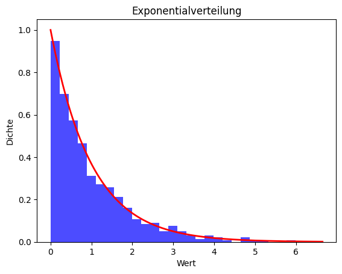

## QM-51-3 Exponentialverteilung

### Beschreibung
  
Die Exponentialverteilung, die in der Grafik dargestellt ist, ist eine wichtige Verteilung in der Statistik und wird häufig verwendet, um die Zeit zwischen unabhängigen Ereignissen in einem Prozess mit konstanter Rate zu modellieren. Ein klassisches Beispiel hierfür ist die Zeit zwischen Ankünften von Kunden in einem Geschäft oder die Zeit bis zum Ausfall eines mechanischen Systems unter kontinuierlichem Betrieb.

### Darstellung

Hier ist die Darstellung der Exponentialverteilung mit einem Rate-Parameter (λ) von 1. Diese Kurve zeigt die Wahrscheinlichkeitsdichtefunktion, wobei die x-Achse die Werte der Zufallsvariablen und die y-Achse die Dichte dieser Werte anzeigt. Die Exponentialverteilung beschreibt typischerweise die Zeit zwischen aufeinanderfolgenden Ereignissen in einem Prozess, bei dem Ereignisse mit konstanter durchschnittlicher Rate eintreten.

### Sourcecode "Exponentialverteilung"

| RefID | Verweis                              |
| ----- | ------------------------------------ |
| 51    | QM-51-3_Exponentialverteilung_python |

### Referenzen

| RefID | Verweis                                                     | Kurzbeschr.                                                                                                                                                                                                                                                                                                                                                                                                                                 |
| ----- | ----------------------------------------------------------- | ------------------------------------------------------------------------------------------------------------------------------------------------------------------------------------------------------------------------------------------------------------------------------------------------------------------------------------------------------------------------------------------------------------------------------------------- |
| 217   |  Introduction to Probability and Statistics \| Mathematics  | Der MIT-Kurs Introduction to Probability and Statistics bietet eine grundlegende Einführung in Wahrscheinlichkeitstheorie und Statistik, behandelt Themen wie Kombinatorik, Zufallsvariablen, Wahrscheinlichkeitsverteilungen, Bayessche Inferenz, Hypothesentests, Konfidenzintervalle und lineare Regression und ermöglicht durch interaktive Materialien in der Open Learning Library eine praxisorientierte und flexible Lernerfahrung. |

