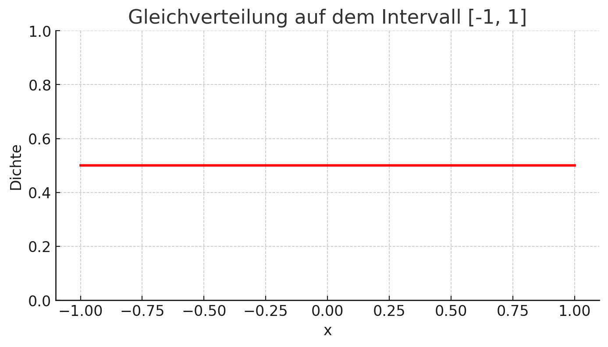

## QM-51-4 Gleichverteilung

### Beschreibung

Die (stetige) Gleichverteilung, auch bekannt als Rechteckverteilung, ist eine kontinuierliche Wahrscheinlichkeitsverteilung, bei der alle möglichen Ergebnisse innerhalb eines bestimmten Intervalls mit gleicher Wahrscheinlichkeit auftreten. Jeder Wert innerhalb des Intervalls hat die gleiche Wahrscheinlichkeit, aufzutreten.

### Darstellung

### Beispiele 

#### Beispiel: Wurf eines fairen Würfels

Ein normaler Würfel hat sechs Seiten, nummeriert von 1 bis 6. Wenn der Würfel fair ist, hat jede Zahl (1, 2, 3, 4, 5, 6) die gleiche Wahrscheinlichkeit, bei einem Wurf zu erscheinen.

- Mögliche Ergebnisse: {1, 2, 3, 4, 5, 6}
- Wahrscheinlichkeit für jedes Ergebnis: 16,67 %

In diesem Fall sind die Wahrscheinlichkeiten für alle möglichen Ausgänge gleich verteilt, da keine Zahl bevorzugt wird und jede Zahl die gleiche Chance hat, geworfen zu werden. Dies ist ein Beispiel für eine Gleichverteilung.

### Referenzen

| RefID | Verweis                                                     | Kurzbeschr.                                                                                                                                                                                                                                                                                                                                                                                                                                 |
| ----- | ----------------------------------------------------------- | ------------------------------------------------------------------------------------------------------------------------------------------------------------------------------------------------------------------------------------------------------------------------------------------------------------------------------------------------------------------------------------------------------------------------------------------- |
| 217   |  Introduction to Probability and Statistics \| Mathematics  | Der MIT-Kurs Introduction to Probability and Statistics bietet eine grundlegende Einführung in Wahrscheinlichkeitstheorie und Statistik, behandelt Themen wie Kombinatorik, Zufallsvariablen, Wahrscheinlichkeitsverteilungen, Bayessche Inferenz, Hypothesentests, Konfidenzintervalle und lineare Regression und ermöglicht durch interaktive Materialien in der Open Learning Library eine praxisorientierte und flexible Lernerfahrung. |

