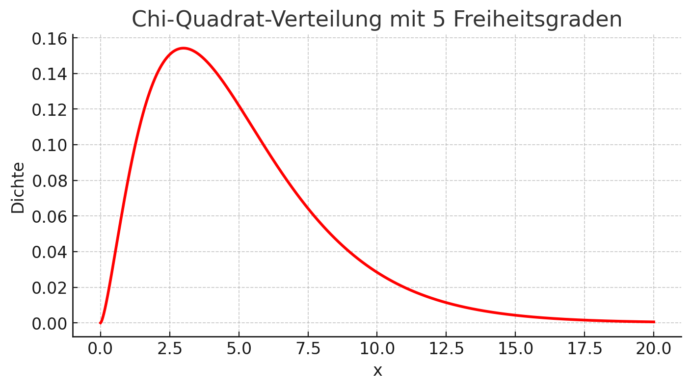

## QM-51-5 Chi-Quadrat-Verteilung

### Beschreibung

Die Chi-Quadrat-Verteilung ist eine kontinuierliche Wahrscheinlichkeitsverteilung, die in der Statistik verwendet wird, um die Verteilung von Zufallsvariablen zu beschreiben, die quadratisch von unabhängigen standardnormalverteilten Zufallsvariablen abhängen. Sie ist besonders nützlich bei Hypothesentests und Konfidenzintervallen für Varianzschätzungen in Stichprobenanalysen.

### Darstellung

Hier die Darstellung einer Chi-Quadrat-Verteilung mit 5 Freiheitsgraden. Die rote Kurve zeigt die Wahrscheinlichkeitsdichtefunktion dieser Verteilung. Die x-Achse repräsentiert die Werte der Zufallsvariablen, während die y-Achse die Dichte dieser Werte anzeigt. Die Chi-Quadrat-Verteilung ist typischerweise rechtsschief, was sich in dieser Darstellung zeigt.

### Sourcecode "Chi-Quadrat-Verteilung"

| RefID | Verweis                               |
| ----- | ------------------------------------- |
| 52    | QM-51-5_Chi-Quadrat Verteilung_python |

### Referenzen

| RefID | Verweis                                                     | Kurzbeschr.                                                                                                                                                                                                                                                                                                                                                                                                                                 |
| ----- | ----------------------------------------------------------- | ------------------------------------------------------------------------------------------------------------------------------------------------------------------------------------------------------------------------------------------------------------------------------------------------------------------------------------------------------------------------------------------------------------------------------------------- |
| 217   |  Introduction to Probability and Statistics \| Mathematics  | Der MIT-Kurs Introduction to Probability and Statistics bietet eine grundlegende Einführung in Wahrscheinlichkeitstheorie und Statistik, behandelt Themen wie Kombinatorik, Zufallsvariablen, Wahrscheinlichkeitsverteilungen, Bayessche Inferenz, Hypothesentests, Konfidenzintervalle und lineare Regression und ermöglicht durch interaktive Materialien in der Open Learning Library eine praxisorientierte und flexible Lernerfahrung. |

