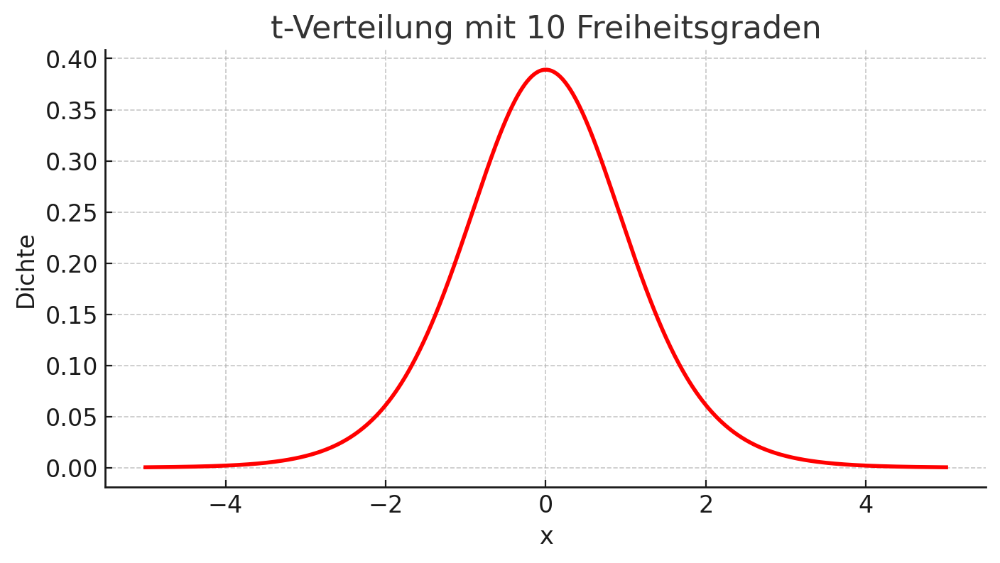
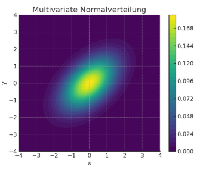

## QM-51-6 t-Verteilung

### Beschreibung

#### Univariate t-Verteilung

Die t-Verteilung ist eine Wahrscheinlichkeitsverteilung, die verwendet wird, um das Verhalten von Stichprobenmittelwerten zu modellieren, wenn die Stichprobengröße klein ist oder die Populationsstandardabweichung unbekannt ist. Sie ähnelt der Normalverteilung, aber mit etwas dickeren Schwänzen, was sie robuster gegenüber Ausreißern macht.

#### Multivariate t-Verteilung

Die multivariate t-Verteilung ist eine Verallgemeinerung der t-Verteilung auf mehrere korrelierte Zufallsvariablen. Sie erlaubt die Modellierung von mehrdimensionalen Datensätzen mit dicken Rändern („schweren Schwänzen“) und ist robuster gegenüber Ausreißern als die multivariate Normalverteilung.  

##### Anwendungsbeispiele:
- Robuste statistische Modellierung mehrdimensionaler Merkmale
- Anomalieerkennung und Klassifikation bei unsicheren oder verrauschten Daten
- Bayessche Modelle mit t-Likelihood

Sie ist insbesondere in Bereichen mit hohem Risiko für Ausreißer oder kleinen Stichprobenmengen von Bedeutung – etwa in der Finanzmodellierung, der Bioinformatik oder im maschinellen Lernen.

### Beispiele 

#### Beispiel 

Ein Beispiel für die Anwendung der t-Verteilung:

Angenommen, 10 Studierende berichten folgende wöchentliche Lernzeiten (in Stunden):  
\[ 15, 18, 12, 20, 24, 10, 15, 22, 16, 19 \]

- Mittelwert ($bar x$) = 17,1 Stunden  
- Standardabweichung (s) = 4,36 Stunden  
- Für 95 % Konfidenz und 9 Freiheitsgrade (n-1) ist der t-Wert 2,262.

Das Konfidenzintervall für den Mittelwert ergibt sich zu:  
 17,1 +- 3,12 Stunden   
Also liegt der wahre Mittelwert zwischen 13,98 und 20,22 Stunden.

### Referenzen

| RefID | Verweis                                                     | Kurzbeschr.                                                                                                                                                                                                                                                                                                                                                                                                                                 |
| ----- | ----------------------------------------------------------- | ------------------------------------------------------------------------------------------------------------------------------------------------------------------------------------------------------------------------------------------------------------------------------------------------------------------------------------------------------------------------------------------------------------------------------------------- |
| 217   |  Introduction to Probability and Statistics \| Mathematics  | Der MIT-Kurs Introduction to Probability and Statistics bietet eine grundlegende Einführung in Wahrscheinlichkeitstheorie und Statistik, behandelt Themen wie Kombinatorik, Zufallsvariablen, Wahrscheinlichkeitsverteilungen, Bayessche Inferenz, Hypothesentests, Konfidenzintervalle und lineare Regression und ermöglicht durch interaktive Materialien in der Open Learning Library eine praxisorientierte und flexible Lernerfahrung. |

