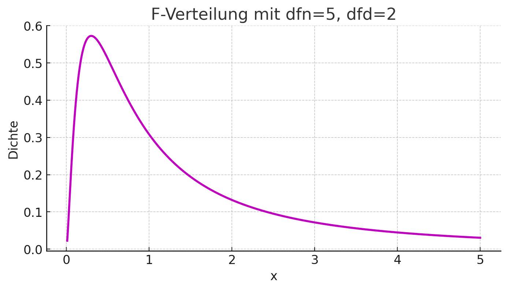
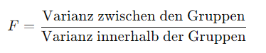

## QM-51-7 F-Verteilung

### Beschreibung

Die F-Verteilung ist eine Wahrscheinlichkeitsverteilung, die in der Statistik verwendet wird, um die Varianzhomogenität zu testen oder die Signifikanz von Unterschieden zwischen den Varianzen von zwei Stichproben zu bewerten. Sie wird häufig in der Analyse der Varianz (ANOVA) und in der Regressionsanalyse verwendet.

### Darstellung

Hier die Darstellung der F-Verteilung mit 5 Zähler Freiheitsgraden (dfn) und 2 Nenner Freiheitsgraden (dfd). Die F-Verteilung wird häufig in der Varianzanalyse verwendet, um Hypothesen über die Gleichheit von Varianzen zu testen. Die x-Achse repräsentiert die Werte der F-Statistik, während die y-Achse die Wahrscheinlichkeitsdichte dieser Werte zeigt.

### Beispiele 

#### Beispiel 1

Man untersucht die Wirksamkeit von drei Lernmethoden bei 30 Schülern, aufgeteilt in drei Gruppen. Es werden die Testergebnisse jeder Gruppe gesammelt und die Varianz innerhalb und zwischen den Gruppen berechnet.

Ein F-Test vergleicht diese Varianzen:

Die Freiheitsgrade (df1 für die Gruppen, df2 für die Gesamtstichprobe) bestimmen die Form der F-Verteilung. Wenn der berechnete F-Wert größer als der kritische F-Wert ist, zeigt dies, dass sich mindestens eine Methode signifikant unterscheidet.

### Referenzen

| RefID | Verweis                                                     | Kurzbeschr.                                                                                                                                                                                                                                                                                                                                                                                                                                 |
| ----- | ----------------------------------------------------------- | ------------------------------------------------------------------------------------------------------------------------------------------------------------------------------------------------------------------------------------------------------------------------------------------------------------------------------------------------------------------------------------------------------------------------------------------- |
| 217   |  Introduction to Probability and Statistics \| Mathematics  | Der MIT-Kurs Introduction to Probability and Statistics bietet eine grundlegende Einführung in Wahrscheinlichkeitstheorie und Statistik, behandelt Themen wie Kombinatorik, Zufallsvariablen, Wahrscheinlichkeitsverteilungen, Bayessche Inferenz, Hypothesentests, Konfidenzintervalle und lineare Regression und ermöglicht durch interaktive Materialien in der Open Learning Library eine praxisorientierte und flexible Lernerfahrung. |

