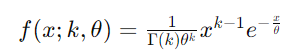
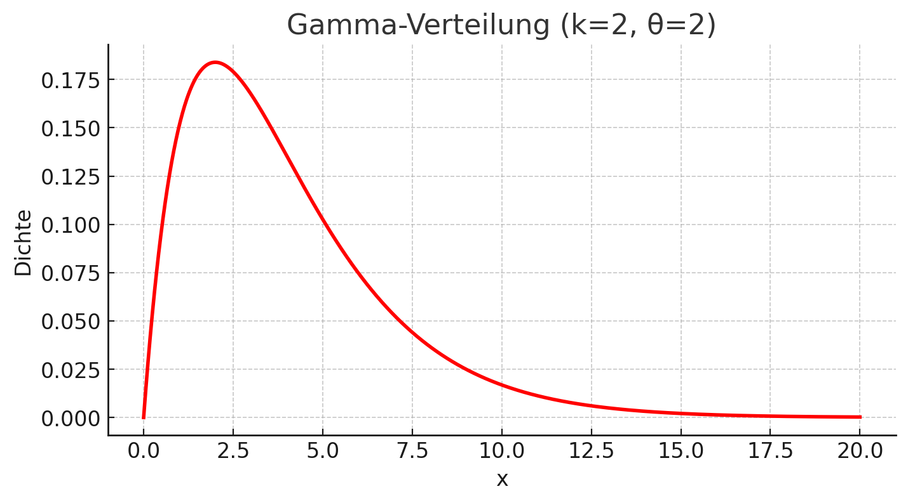

## QM-51-8 Gamma-Verteilung

### Beschreibung

Die Gamma-Verteilung ist eine kontinuierliche Wahrscheinlichkeitsverteilung, die oft zur Modellierung von positiven, reellen Zufallsvariablen verwendet wird. Sie ist durch zwei Parameter gekennzeichnet: die Formparameter k und den Skalenparameter θ. Die Wahrscheinlichkeitsdichtefunktion (PDF) der Gamma-Verteilung ist gegeben durch:
### Formel

wobei x≥0, k>0 und θ>0 sind, und Γ(k) die Gamma-Funktion ist. Die Gamma-Verteilung wird in vielen Bereichen wie der Statistik, der Finanzwirtschaft und den Naturwissenschaften verwendet.

### Darstellung

Hier ist die Darstellung der Gamma-Verteilung mit einem Formparameter k=2 und einem Skalenparameter θ=2. Die x-Achse zeigt die Werte der Zufallsvariable und die y-Achse die Wahrscheinlichkeitsdichte. Die Kurve illustriert, wie die Dichte der Werte verteilt ist, wobei die Dichte mit zunehmendem Wert von x abnimmt.

### Beispiele 

#### Beispiel 1 - Zeit bis zum Auftreten mehrerer Ereignisse

##### Warteschlangentheorie: Wartezeiten in einem System:
- In einem Callcenter treffen Anrufe zufällig mit einer bestimmten durchschnittlichen Anrufrate ein (Poisson-Prozess).
- Die Gamma-Verteilung kann verwendet werden, um die **Gesamtzeit bis zum Abschluss von `$k$` Anrufen** zu modellieren, wenn die Anrufe unabhängig voneinander bearbeitet werden und die Bearbeitungszeit eines Anrufs exponentiell verteilt ist.

#### Anwendung:
- Der Formparameter k entspricht der Anzahl der Anrufe, die abgeschlossen werden müssen.
- Der Skalenparameter θ entspricht der mittleren Bearbeitungszeit eines Anrufs.

### Beispielhafte Interpretation:

Angenommen:
- `$k$\-$θ$`=5: Minuten: Jeder Anruf dauert im Mittel 5 Minuten.

Die Gamma-Verteilung sagt aus, wie lange es im Durchschnitt dauert, bis der Mitarbeiter 3 Anrufe abgeschlossen hat. Die Wahrscheinlichkeit, dass diese Zeit in einem bestimmten Bereich liegt, kann mit der Verteilung berechnet werden.

Dieses Beispiel kann auf andere Systeme übertragen werden, wie z. B. die **Bearbeitungszeit in Produktionssystemen** oder **Ladezeiten in Computernetzwerken**.

### Referenzen

| RefID | Verweis                                                     | Kurzbeschr.                                                                                                                                                                                                                                                                                                                                                                                                                                 |
| ----- | ----------------------------------------------------------- | ------------------------------------------------------------------------------------------------------------------------------------------------------------------------------------------------------------------------------------------------------------------------------------------------------------------------------------------------------------------------------------------------------------------------------------------- |
| 217   |  Introduction to Probability and Statistics \| Mathematics  | Der MIT-Kurs Introduction to Probability and Statistics bietet eine grundlegende Einführung in Wahrscheinlichkeitstheorie und Statistik, behandelt Themen wie Kombinatorik, Zufallsvariablen, Wahrscheinlichkeitsverteilungen, Bayessche Inferenz, Hypothesentests, Konfidenzintervalle und lineare Regression und ermöglicht durch interaktive Materialien in der Open Learning Library eine praxisorientierte und flexible Lernerfahrung. |

