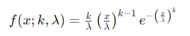
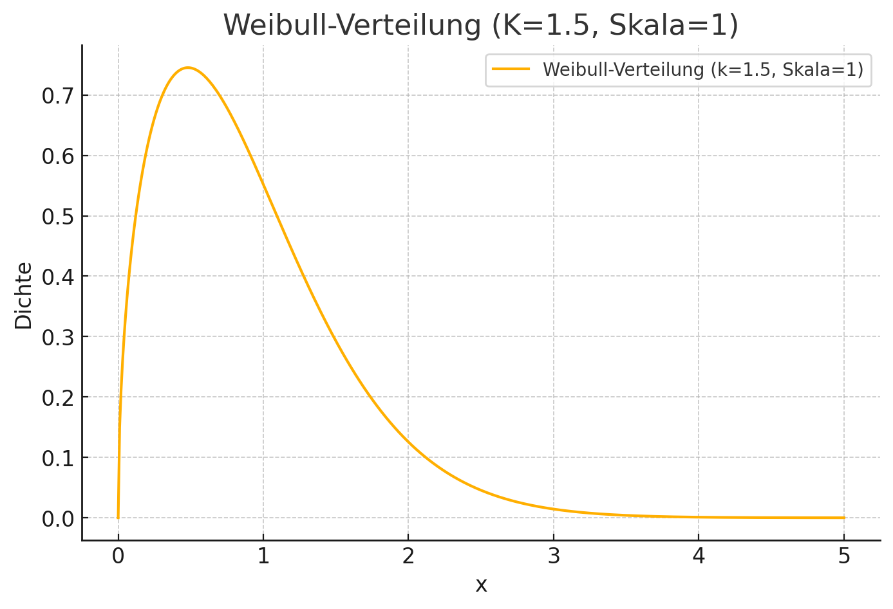

## QM-51-9 Weibull-Verteilung

### Beschreibung

Die Weibull-Verteilung ist eine kontinuierliche Wahrscheinlichkeitsverteilung, die häufig in der Zuverlässigkeits- und Lebensdaueranalyse verwendet wird. Sie kann verschiedene Formen haben und wird oft verwendet, um die Verteilung von Lebensdauern von technischen Geräten oder Materialien zu modellieren.

### Formel

- x ist die Variable (x ≥ 0),
- k ist der Formparameter der Verteilung (k > 0), oft auch als Formfaktor bezeichnet,
- λ ist der Skalenparameter der Verteilung (λ > 0).

#### Bedeutung der Parameter:

- Der **Formparameter k** beeinflusst die Form der Verteilungskurve:
    - Wenn k<1, zeigt die Verteilung eine abnehmende Ausfallrate (nützlich für die Modellierung von "Kinderkrankheiten" von Produkten).
    - Wenn k=1, wird die Weibull-Verteilung zu einer Exponentialverteilung mit konstanter Ausfallrate.
    - Wenn k>1, zeigt die Verteilung eine zunehmende Ausfallrate, was typisch ist für Alterungsprozesse von Materialien.
- Der **Skalenparameter λ** setzt die Skala der Zeitachse, auf der die Ereignisse betrachtet werden. Ein größerer λ bedeutet, dass die durchschnittliche Lebensdauer länger ist.

### Darstellung

### Beispiele 

#### Beispiel 1

Wir analysieren die Lebensdauer von Glühbirnen. Die Lebensdauer (in Stunden) einer bestimmten Glühbirnenmarke folgt einer Weibull-Verteilung mit einem **Formparameter** k = 1.5 und einem **Skalenparameter** $lambda$ = 1000 Stunden.

####  Bedeutung der Parameter:
- **Formparameter k = 1.5**: Wenn k > 1, bedeutet dies, dass die Ausfallrate mit der Zeit ansteigt. Das ist typisch für "Alterungsprozesse" – je älter eine Glühbirne ist, desto wahrscheinlicher ist ihr Ausfall.
- **Skalenparameter $lambda$ = 1000**: Dies bedeutet, dass die durchschnittliche Lebensdauer der Glühbirnen etwa 1000 Stunden beträgt.

#### Anwendung:
Die Wahrscheinlichkeit, dass eine Glühbirne nach 800 Stunden noch funktioniert, lässt sich mit der Weibull-Verteilungsfunktion berechnen:

$P(T > t) = e^{-(t/\lambda)^k}$

Für $t$ = 800, $lambda$ = 1000, und $k$ = 1.5:

$P(T > 800) = e^{-(800/1000)^{1.5}} = e^{-0.512} \approx 0.599$

Das bedeutet, dass nach 800 Stunden etwa 59,9 % der Glühbirnen noch funktionieren.

#### Interpretation:
- **Lebensdauer**: Die meisten Glühbirnen halten bis etwa 1000 Stunden, aber es gibt eine zunehmende Wahrscheinlichkeit, dass sie nach dieser Zeit ausfallen.
- **Höhere k-Werte**: Würde der Formparameter k größer werden (z. B. k = 2), würde dies bedeuten, dass die Glühbirnen eine kürzere durchschnittliche Lebensdauer haben und schneller ausfallen.

### Referenzen

| RefID | Verweis                                                                                              | Kurzbeschr.                                                                                                                                                                                                                                                                                                                                                                                                                                 |
| ----- | ---------------------------------------------------------------------------------------------------- | ------------------------------------------------------------------------------------------------------------------------------------------------------------------------------------------------------------------------------------------------------------------------------------------------------------------------------------------------------------------------------------------------------------------------------------------- |
| 197   |  Distributional Ground Truth: Non-Redundant Crowdsourcing Data Quality Control in UI Labeling Tasks  | Das Papier präsentiert ein nicht-redundantes Verfahren zur Vorhersage der Qualität von Crowdworker-Labels bei Web-UI-Annotationen, das Verteilungen per Kolmogorov-Smirnov-Test vergleicht und so bei einer Trusted-Set-Größe von 17–27 % R²-Werte über 0,8 erreicht und redundante Kontrollen ersetzt.                                                                                                                                     |
| 217   |  Introduction to Probability and Statistics \| Mathematics                                           | Der MIT-Kurs Introduction to Probability and Statistics bietet eine grundlegende Einführung in Wahrscheinlichkeitstheorie und Statistik, behandelt Themen wie Kombinatorik, Zufallsvariablen, Wahrscheinlichkeitsverteilungen, Bayessche Inferenz, Hypothesentests, Konfidenzintervalle und lineare Regression und ermöglicht durch interaktive Materialien in der Open Learning Library eine praxisorientierte und flexible Lernerfahrung. |

