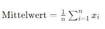

## QM-52-01 Average Value

### Beschreibung

Der Mittelwert von Daten ist die Summe aller Datenpunkte geteilt durch die Anzahl der Datenpunkte. Es ist ein Maß für die zentrale Tendenz und gibt den durchschnittlichen Wert der Daten an. Aufgrund der Berechnung ist dieses Maß jedoch besonders anfällig für Extremwerte/Ausreißer.

### Formel

### Sourcecode "Average Value"
| RefID | Verweis                       |
| ----- | ----------------------------- |
| 54    | QM-52-01_Average Value_python |

### Referenzen
| RefID | Verweis                                                     | Kurzbeschr.                                                                                                                                                                                                                                                                                                                                                                                                                                 |
| ----- | ----------------------------------------------------------- | ------------------------------------------------------------------------------------------------------------------------------------------------------------------------------------------------------------------------------------------------------------------------------------------------------------------------------------------------------------------------------------------------------------------------------------------- |
| 217   |  Introduction to Probability and Statistics \| Mathematics  | Der MIT-Kurs Introduction to Probability and Statistics bietet eine grundlegende Einführung in Wahrscheinlichkeitstheorie und Statistik, behandelt Themen wie Kombinatorik, Zufallsvariablen, Wahrscheinlichkeitsverteilungen, Bayessche Inferenz, Hypothesentests, Konfidenzintervalle und lineare Regression und ermöglicht durch interaktive Materialien in der Open Learning Library eine praxisorientierte und flexible Lernerfahrung. |

