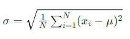

## QM-52-04 Standardabweichung
### Beschreibung

Die Standardabweichung ist ein Maß für die Streuung oder Variation der Werte in einem Datensatz um den Durchschnittswert.

### Formel

Hierbei ist $N$ die Anzahl der Datenpunkte, $x_i$​ sind die einzelnen Datenwerte, und $μ$ ist der Mittelwert der Daten.

### Sourcecode "Standardabweichung"
| RefID | Verweis                           |
| ----- | --------------------------------- |
| 57    | QM-52-04_StandardDeviation_python |

### Referenzen
| RefID | Verweis                                                     | Kurzbeschr.                                                                                                                                                                                                                                                                                                                                                                                                                                 |
| ----- | ----------------------------------------------------------- | ------------------------------------------------------------------------------------------------------------------------------------------------------------------------------------------------------------------------------------------------------------------------------------------------------------------------------------------------------------------------------------------------------------------------------------------- |
| 217   |  Introduction to Probability and Statistics \| Mathematics  | Der MIT-Kurs Introduction to Probability and Statistics bietet eine grundlegende Einführung in Wahrscheinlichkeitstheorie und Statistik, behandelt Themen wie Kombinatorik, Zufallsvariablen, Wahrscheinlichkeitsverteilungen, Bayessche Inferenz, Hypothesentests, Konfidenzintervalle und lineare Regression und ermöglicht durch interaktive Materialien in der Open Learning Library eine praxisorientierte und flexible Lernerfahrung. |

