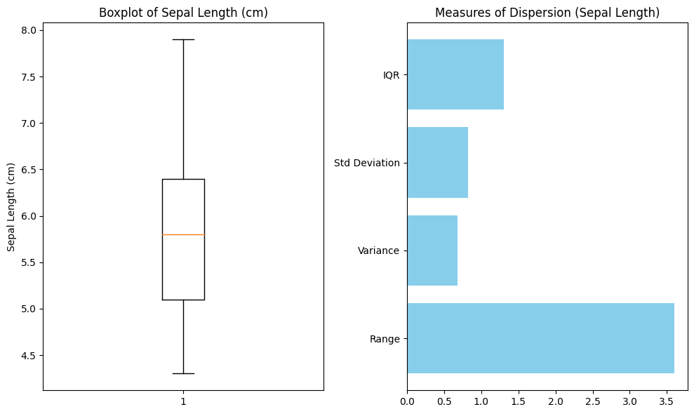

## QM-52-05 Streuung

### Beschreibung

Statistische Streuung bezieht sich auf die Variation oder Verbreitung von Daten um einen zentralen Wert, wie zum Beispiel den Mittelwert. Sie gibt an, wie weit die einzelnen Datenpunkte von diesem zentralen Wert entfernt sind und wie homogen oder heterogen die Daten sind. 

- Maße für statistische Streuung umfassen 
	- die Spannweite, 
	- die Standardabweichung, 
	- die Varianz und den Interquartilsabstand.

Diese Maße helfen dabei, die Verteilung der Daten zu verstehen und ihre Variabilität zu quantifizieren. Je größer die Streuung, desto größer ist die Variabilität der Datenpunkte, während geringere Streuung auf eine engere Clusterung der Daten um den zentralen Wert hinweist.

### Methode

In der Grafik werden die Maße für die Streuung grafisch dargestellt. (Grafik erstellt anhand des Beispielcodes für den Iris Datensatz )

### Sourcecode "Streuung"

| RefID | Verweis                  |
| ----- | ------------------------ |
| 58    | QM-52-05_Streuung_python |

### Referenzen

| RefID | Verweis                                                     | Kurzbeschr.                                                                                                                                                                                                                                                                                                                                                                                                                                 |
| ----- | ----------------------------------------------------------- | ------------------------------------------------------------------------------------------------------------------------------------------------------------------------------------------------------------------------------------------------------------------------------------------------------------------------------------------------------------------------------------------------------------------------------------------- |
| 217   |  Introduction to Probability and Statistics \| Mathematics  | Der MIT-Kurs Introduction to Probability and Statistics bietet eine grundlegende Einführung in Wahrscheinlichkeitstheorie und Statistik, behandelt Themen wie Kombinatorik, Zufallsvariablen, Wahrscheinlichkeitsverteilungen, Bayessche Inferenz, Hypothesentests, Konfidenzintervalle und lineare Regression und ermöglicht durch interaktive Materialien in der Open Learning Library eine praxisorientierte und flexible Lernerfahrung. |

