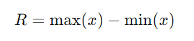

## QM-52-06 Spannweite

### Beschreibung

Die Spannweite ist ein Maß für die Streuung von Daten und wird als die Differenz zwischen dem größten und dem kleinsten Wert in einem Datensatz definiert.

Sie gibt an, wie weit die Daten voneinander entfernt sind und wie groß der Bereich der möglichen Werte ist. Sie wird oft als erstes exploratives Maß verwendet, um einen groben Eindruck des Wertebereichs der Daten zu erhalten, ist jedoch anfällig gegenüber Extremwerten.

### Methode

)

Hierbei steht $max(x)$ für den größten Wert und $min(x)$ für den kleinsten Wert im Datensatz x.

### Sourcecode "Spannweite"
| RefID | Verweis                    |
| ----- | -------------------------- |
| 59    | QM-52-06_Spannweite_python |

### Referenzen
| RefID | Verweis                                                     | Kurzbeschr.                                                                                                                                                                                                                                                                                                                                                                                                                                 |
| ----- | ----------------------------------------------------------- | ------------------------------------------------------------------------------------------------------------------------------------------------------------------------------------------------------------------------------------------------------------------------------------------------------------------------------------------------------------------------------------------------------------------------------------------- |
| 217   |  Introduction to Probability and Statistics \| Mathematics  | Der MIT-Kurs Introduction to Probability and Statistics bietet eine grundlegende Einführung in Wahrscheinlichkeitstheorie und Statistik, behandelt Themen wie Kombinatorik, Zufallsvariablen, Wahrscheinlichkeitsverteilungen, Bayessche Inferenz, Hypothesentests, Konfidenzintervalle und lineare Regression und ermöglicht durch interaktive Materialien in der Open Learning Library eine praxisorientierte und flexible Lernerfahrung. |

