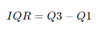

## QM-52-07 Interquartilsabstand

### Beschreibung

Der Interquartilsabstand (IQR) ist ein Streuungsmaß und gibt die Breite des Bereichs an, in dem sich die mittleren 50% der Daten befinden. Er wird durch die Differenz zwischen dem dritten Quartil (Q3) und dem ersten Quartil (Q1) des Datensatzes definiert.

### Methode

Der Interquartilsabstand ist ein robustes Maß für die Streuung, da er weniger empfindlich gegenüber Ausreißern in den Daten ist als die Spannweite oder die Standardabweichung. Er wird häufig in der deskriptiven Statistik verwendet, um die Streuung von Daten zu charakterisieren und Ausreißer zu identifizieren.

### Sourcecode "Interquartilsabstand"
| RefID | Verweis                              |
| ----- | ------------------------------------ |
| 60    | QM-52-07_Interquartilsabstand_python |

### Referenzen
| RefID | Verweis                                                     | Kurzbeschr.                                                                                                                                                                                                                                                                                                                                                                                                                                 |
| ----- | ----------------------------------------------------------- | ------------------------------------------------------------------------------------------------------------------------------------------------------------------------------------------------------------------------------------------------------------------------------------------------------------------------------------------------------------------------------------------------------------------------------------------- |
| 217   |  Introduction to Probability and Statistics \| Mathematics  | Der MIT-Kurs Introduction to Probability and Statistics bietet eine grundlegende Einführung in Wahrscheinlichkeitstheorie und Statistik, behandelt Themen wie Kombinatorik, Zufallsvariablen, Wahrscheinlichkeitsverteilungen, Bayessche Inferenz, Hypothesentests, Konfidenzintervalle und lineare Regression und ermöglicht durch interaktive Materialien in der Open Learning Library eine praxisorientierte und flexible Lernerfahrung. |

