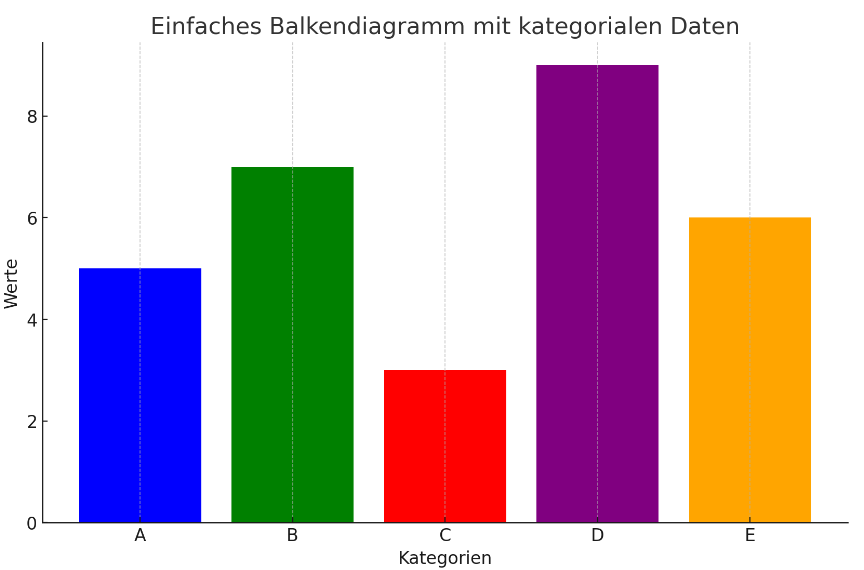
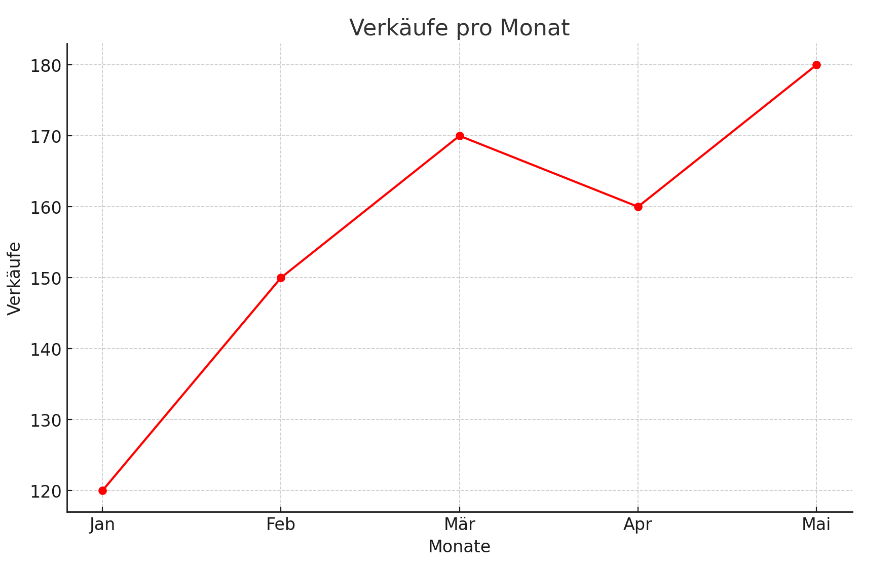
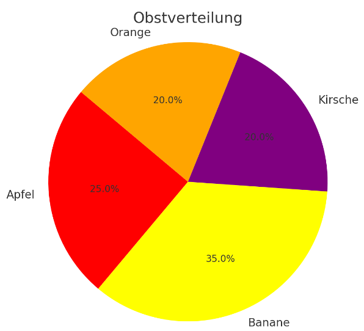
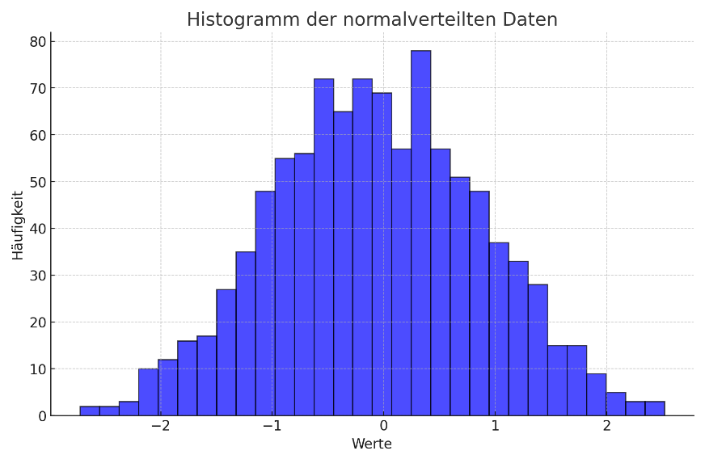
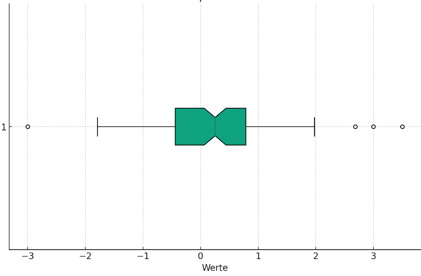
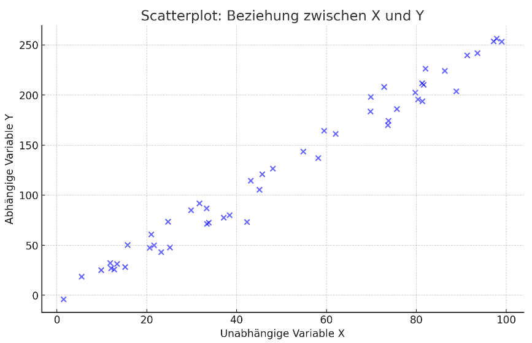
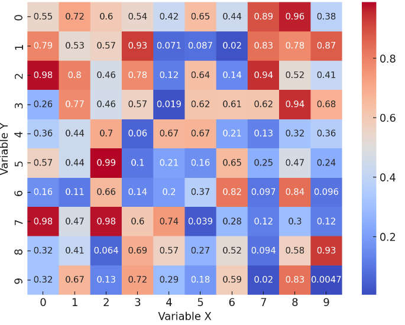

## QM-52-08 Darstellungstypen

### Beschreibung

Die grafische Darstellung von Daten bietet eine Reihe von Vorteilen, die für das Verständnis und die Kommunikation von Informationen relevant sind:

* Schnelle Informationsaufnahme: Menschen verarbeiten visuelle Informationen schneller als Text oder Zahlen. Diagramme ermöglichen es, Muster, Trends und Ausreißer auf einen Blick zu erkennen.
* Vereinfachung komplexer Daten: Komplizierte Datensätze können in einfacheren visuellen Formaten dargestellt werden, was die Interpretation erleichtert.
* Vergleichbarkeit: Durch die Nutzung von Grafiken können verschiedene Datensätze oder Variablen direkt miteinander verglichen werden.
* Entdeckung von Korrelationen und Mustern: Bestimmte Arten von Grafiken, wie Scatterplots, können helfen, Korrelationen zwischen Variablen zu identifizieren.

### Methode

Die Wahl der richtigen Grafikart ist entscheidend, um sicherzustellen, dass die Daten korrekt interpretiert und die wichtigsten Aspekte hervorgehoben werden.

#### Darstellungsarten

Die Art der grafischen Darstellung hängt vom Datentyp und dem gewünschten Einblick ab:

#### Balkendiagramme 

Gut für kategoriale Datenvergleiche.

#### Liniendiagramme 

Ideal für Trendanalysen in Zeitreihendaten.

#### Kreisdiagramme 

Nützlich, um Anteile einer Verteilung darzustellen.

#### Histogramme 

Geeignet, um die Verteilung von Daten zu zeigen.

#### Boxplots 

Veranschaulicht die Verteilung von Daten und Ausreißern.

Der zentrale Kasten repräsentiert den Interquartilsbereich (IQR), die Linie in der Mitte des Kastens den Median. Die "Whisker" (Schnurrbärte) erstrecken sich zu den am weitesten entfernten Punkten, die noch innerhalb des 1,5-fachen IQR vom oberen bzw. unteren Quartil liegen. Ausreißer sind als Punkte dargestellt und liegen außerhalb der Whisker-Bereiche

#### Scatterplots

Gut geeignet zur Untersuchung von Beziehungen zwischen zwei quantitativen Variablen.

Hier ist ein einfacher Scatterplot, der die Beziehung zwischen zwei quantitativen Variablen darstellt. Die unabhängige Variable X ist auf der x-Achse aufgetragen, während die abhängige Variable Y, die eine lineare Beziehung zu X aufweist, auf der y-Achse gezeigt wird. Der Graph veranschaulicht, wie Y mit X zunimmt, wobei einige Variationen durch das eingefügte Rauschen sichtbar sind. ​

#### Heatmaps

Effektiv, um komplexe Datenmatrizen und Korrelationen darzustellen.

Diese Heatmap stellt eine 10x10 Datenmatrix dar. Jedes Feld in der Matrix zeigt den Wert der Daten zwischen zwei Variablen an. Die Farbskala (von blau bis rot) verdeutlicht die Größe der Werte: Blaue Töne stehen für niedrigere und rote Töne für höhere Werte. Die Beschriftungen in den Feldern bieten eine direkte Ablesbarkeit der Datenwerte, was diese Art der Visualisierung besonders nützlich macht, um komplexe Datenmatrizen und Korrelationen zwischen Variablen einfach und verständlich zu präsentieren.

