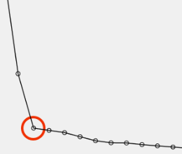

## QM-20 Scree-Plot

### Beschreibung

Ein Scree-Plot zeigt die Eigenwerte der Komponenten in absteigender Reihenfolge. 
Im Rahmen der Dimensionsreduktion hilft er dabei zu bestimmen, wie viele Hauptkomponenten beibehalten werden sollten. Ein deutlicher „Ellbogen“ im Plot kann darauf hindeuten, dass zusätzliche Komponenten nur einen marginalen Beitrag zur erklärten Varianz leisten.

"Ellbogen":
Der "Ellbogen" im Scree Plot ist der Punkt, an dem die Kurve der Eigenwerte eine scharfe Abbiegung oder Krümmung aufweist und flacher wird.

### Methode

Dieser Punkt wird oft als Indikator dafür verwendet, wie viele Hauptkomponenten behalten werden sollten. Normalerweise werden die Hauptkomponenten behalten, die den Eigenwerten vor dem Ellbogen entsprechen, da sie einen Großteil der Variation in den Daten erklären, während diejenigen nach dem Ellbogen wenig zusätzliche Information liefern.

- Datenvorbereitung: Zunächst wurden die Daten gesammelt und aufbereitet. Fehlende Werte wurden behandelt, und kategoriale Variablen wurden gegebenenfalls kodiert.
    
- Standardisierung der Daten: Da PCA empfindlich auf die Skalierung der Variablen reagiert, wurden alle Variablen standardisiert, sodass sie einen Mittelwert von Null und eine Standardabweichung von Eins haben.
    
- Berechnung der Kovarianzmatrix: Die Kovarianzmatrix der standardisierten Daten wurde berechnet, um die Varianz und Kovarianz zwischen den Variablen zu erfassen.
    
- Eigenwertzerlegung: Die Eigenwerte und Eigenvektoren der Kovarianzmatrix wurden ermittelt. Die Eigenwerte geben an, wie viel Varianz jede Hauptkomponente erklärt.
    
- Erstellung des Scree-Plots: Die Eigenwerte wurden in absteigender Reihenfolge sortiert und gegen die Nummer der entsprechenden Hauptkomponente aufgetragen. Dies ergibt den Scree Plot.

#### Scree-Plot Interpretation:
Der Scree Plot zeigt auf der x-Achse die Hauptkomponentennummer und auf der y-Achse den entsprechenden Eigenwert (oder den Prozentsatz der erklärten Varianz). Typischerweise sucht man nach einem "Knick" im Plot (dem sogenannten "Ellbogen"), nach dem die zusätzlichen Hauptkomponenten nur noch einen geringen zusätzlichen Anteil an der Gesamtvarianz erklären. Dieser Punkt hilft dabei, die optimale Anzahl an Hauptkomponenten für die weitere Analyse zu bestimmen.

### Sourcecode "Scree-Plot"

| RefID | Verweis                 |
| ----- | ----------------------- |
| 22    | QM-20_Scree-Plot_python |

### Referenzen

| RefID | Verweis                                                     | Kurzbeschr.                                                                                                                                                                                                                                                                                                                                                                                                                                 |
| ----- | ----------------------------------------------------------- | ------------------------------------------------------------------------------------------------------------------------------------------------------------------------------------------------------------------------------------------------------------------------------------------------------------------------------------------------------------------------------------------------------------------------------------------- |
| 217   |  Introduction to Probability and Statistics \| Mathematics  | Der MIT-Kurs Introduction to Probability and Statistics bietet eine grundlegende Einführung in Wahrscheinlichkeitstheorie und Statistik, behandelt Themen wie Kombinatorik, Zufallsvariablen, Wahrscheinlichkeitsverteilungen, Bayessche Inferenz, Hypothesentests, Konfidenzintervalle und lineare Regression und ermöglicht durch interaktive Materialien in der Open Learning Library eine praxisorientierte und flexible Lernerfahrung. |

