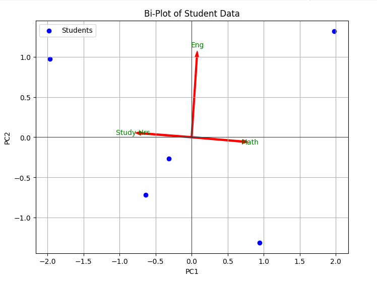

## QM-24 Bi-Plot

### Beschreibung

Ein Bi-Plot ist ein grafisches Werkzeug, das häufig in der multivariaten Datenanalyse verwendet wird, um die Ergebnisse einer Hauptkomponentenanalyse (Principal Component Analysis, PCA) zu visualisieren. Es kombiniert sowohl die Information über die ursprünglichen Variablen als auch die Datenpunkte in einem einzigen Plot.

In einem Bi-Plot werden zwei Arten von Informationen dargestellt:

- **Punkte**: Diese repräsentieren die Beobachtungen (z. B. einzelne Datensätze), projiziert auf die Hauptkomponenten. Die Position der Punkte zeigt an, wie diese Beobachtungen relativ zueinander in Bezug auf die neuen Hauptkomponenten verteilt sind.
    
- **Vektoren (Pfeile)**: Diese repräsentieren die ursprünglichen Variablen des Datensatzes. Die Richtung und Länge der Pfeile zeigen an, wie stark jede Variable zu den Hauptkomponenten beiträgt. Die Länge eines Pfeils steht für die Wichtigkeit der Variablen, und die Richtung gibt an, wie sie mit den Hauptkomponenten korreliert ist.

### Methode

**Erkennung von Ausreißern:** 
Bi-Plots können genutzt werden, um Ausreißer in den Daten zu identifizieren. Wenn einige Datenpunkte weit von anderen entfernt liegen oder in einem unerwarteten Bereich des Plots erscheinen, könnten diese als Ausreißer betrachtet werden. Das Erkennen von Ausreißern ist wichtig, um sicherzustellen, dass das Trainingsmodell nicht durch anomale Daten verzerrt wird. 

**Überprüfung der Skalierung und Normalisierung:** 
Bi-Plots können aufzeigen, ob die Daten angemessFen skaliert und normalisiert wurden, was für viele Algorithmen des maschinellen Lernens wesentlich ist. Eine ungleichmäßige Skalierung der Achsen oder eine auffällige Gruppierung der Datenpunkte kann darauf hindeuten, dass die Daten vor der Modellbildung weiter bearbeitet werden müssen.
    
**Beurteilung der Merkmalsrelevanz:** 
Mit Bi-Plots lässt sich visualisieren, welche Merkmale (Variablen) die größten Beiträge zur Varianz im Datensatz leisten. Merkmale, die eng mit den Hauptkomponenten verbunden sind, sind oft relevanter für das Modell. Dies hilft bei der Auswahl und dem Ausschluss von Merkmalen im Prozess des Feature-Engineerings.
    
**Verständnis der Datenstruktur:** 
Ein Bi-Plot ermöglicht es, die grundlegende Struktur der Daten zu verstehen, indem er zeigt, wie Beobachtungen zueinander in Beziehung stehen und welche Variablen diese Beziehungen beeinflussen. Dies ist besonders nützlich, um zu verstehen, wie gut die Trainingsdaten die realen Bedingungen repräsentieren, die das Modell behandeln soll.
    
**Visualisierung von Gruppen oder Clustern:** 
Wenn die Daten natürliche Gruppierungen oder Cluster enthalten, können Bi-Plots dazu beitragen, diese zu identifizieren. Dies ist wichtig für Algorithmen, die auf Gruppenbildung basieren, wie z.B. Clustering oder Klassifikation.

### Sourcecode "Bi-Plot"
| RefID | Verweis             |
| ----- | ------------------- |
| 24    | QM-24_Biplot_python |

### Referenzen
| RefID | Verweis                                                     | Kurzbeschr.                                                                                                                                                                                                                                                                                                                                                                                                                                 |
| ----- | ----------------------------------------------------------- | ------------------------------------------------------------------------------------------------------------------------------------------------------------------------------------------------------------------------------------------------------------------------------------------------------------------------------------------------------------------------------------------------------------------------------------------- |
| 217   |  Introduction to Probability and Statistics \| Mathematics  | Der MIT-Kurs Introduction to Probability and Statistics bietet eine grundlegende Einführung in Wahrscheinlichkeitstheorie und Statistik, behandelt Themen wie Kombinatorik, Zufallsvariablen, Wahrscheinlichkeitsverteilungen, Bayessche Inferenz, Hypothesentests, Konfidenzintervalle und lineare Regression und ermöglicht durch interaktive Materialien in der Open Learning Library eine praxisorientierte und flexible Lernerfahrung. |

