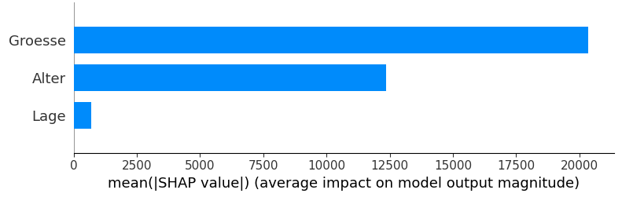

## QM-54-1 SHAP-Summaryplot

### Beschreibung

Der SHAP (SHapley Additive exPlanations) Summary Plot ist ein Visualisierungswerkzeug, das verwendet wird, um die Auswirkungen von Features (Merkmale) auf die Vorhersagen eines maschinellen Lernmodells zu interpretieren. Dieses Tool basiert auf der Spieltheorie und insbesondere auf den Shapley-Werten, die angeben, wie viel jedes Feature zur Vorhersage im Vergleich zum Durchschnitt beiträgt.

#### Funktionen des SHAP Summary Plot:

- **Globale Interpretierbarkeit**: Der Plot zeigt, wie viel Einfluss jedes Feature auf das Modell insgesamt hat.
- **Feature-Wichtigkeit**: Die Features werden auf der Y-Achse nach ihrer Bedeutung sortiert, wobei die wichtigsten oben stehen.
- **Wirkungsrichtung**: Die Farbe der Punkte gibt an, ob der Einfluss eines Features die Vorhersage erhöht oder verringert. Typischerweise zeigen rote Punkte einen positiven Einfluss und blaue Punkte einen negativen.
- **Verteilung der Werte**: Die Position der Punkte auf der X-Achse zeigt die Stärke des Einflusses. Mehr Punkte in einer Richtung zeigen eine stärkere Wirkung dieses Features.

### Sourcecode "SHAP-Summaryplot"

| RefID | Verweis                         |
| ----- | ------------------------------- |
| 65    | QM-54-1_SHAP-Summaryplot_python |

### Referenzen

| RefID | Verweis                          | Kurzbeschr.                                                                                                                                                                                                                                                                                                                                |
| ----- | -------------------------------- | ------------------------------------------------------------------------------------------------------------------------------------------------------------------------------------------------------------------------------------------------------------------------------------------------------------------------------------------ |
| 291   |  Interpretable Machine Learning  | Das Buch Interpretable Machine Learning – A Guide for Making Black Box Models Explainable von Christoph Molnar bietet einen umfassenden Überblick über theoretische und praxisnahe Methoden zur Erklärung und Interpretation von Black-Box-Modellen im Machine Learning, um deren Verhalten transparenter und nachvollziehbarer zu machen. |

