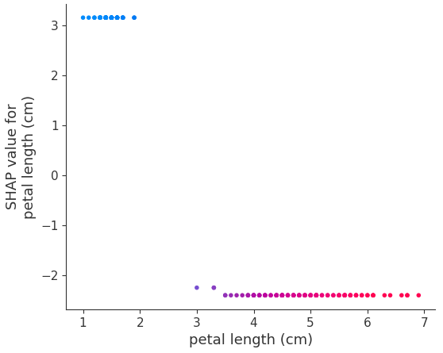
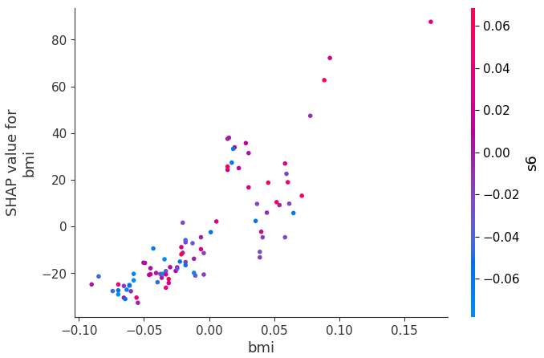

## QM-54-2 SHAP-Dependence-Plot

### Beschreibung
  
Der SHAP(SHapley Additive exPlanations)-Dependence-Plot ist ein Werkzeug, um den Einfluss einzelner Merkmale auf die Vorhersage eines maschinellen Lernmodells zu visualisieren. Dieses Visualisierungswerkzeug basiert auf den SHAP-Werten, die eine Methode der Spieltheorie nutzen, um den Beitrag jedes Merkmals zu einer bestimmten Vorhersage im Modell zu bewerten. Der Dependence Plot zeigt die Beziehung zwischen dem Wert eines Merkmals und dem Einfluss dieses Merkmals auf die Vorhersage.

#### Funktionsweise des SHAP Dependence Plots

- **Achsen**: Auf der x-Achse wird der Wert des Merkmals abgetragen und auf der y-Achse der SHAP-Wert dieses Merkmals. Ein höherer SHAP-Wert bedeutet einen größeren Einfluss des Merkmals auf die Vorhersage.
- **Farbcodierung**: Häufig wird ein zweites Merkmal zur Farbcodierung verwendet, um zu zeigen, wie die Interaktion zwischen zwei Merkmalen die Vorhersage beeinflusst.
- **Trends und Muster**: Der Plot kann Trends und Muster aufzeigen, wie bestimmte Werte des Merkmals tendenziell die Vorhersage beeinflussen.

#### Beispiel 1 - SHAP Dependence Plot - Iris Datensatz

#### Beispiel 2 - SHAP Dependence Plot - Diabetes Datensatz 

### Sourcecode "SHAP-Dependence-Plot"

| RefID | Verweis                               | Inhalt                                   |
| ----- | ------------------------------------- | ---------------------------------------- |
| 67    | QM-54-2_SHAP-Dependence-Plot_python   | Klassifikationsbeispiel - Iris Datensatz |
| 66    | QM-54-2_SHAP-Dependence-Plot_2_python | Regressionsbeispiel - Diabetes Datensatz |

### Referenzen

| RefID | Verweis                                 | Kurzbeschr.                                                                                                                                                                                                                                                                                                                                                                         |
| ----- | --------------------------------------- | ----------------------------------------------------------------------------------------------------------------------------------------------------------------------------------------------------------------------------------------------------------------------------------------------------------------------------------------------------------------------------------- |
| 81    |  The Shapley Value in Machine Learning  | In diesem Paper werden die grundlegenden Konzepte der kooperativen Spieltheorie und die axiomatischen Eigenschaften des Shapley-Werts diskutiert sowie dessen Anwendungen in der maschinellen Lernpraxis, einschließlich Merkmalsauswahl, Erklärbarkeit und Multi-Agenten-Verstärkungslernen, sowie die wichtigsten Einschränkungen und zukünftige Forschungsrichtungen aufgezeigt. |
| 291   |  Interpretable Machine Learning         | Das Buch Interpretable Machine Learning – A Guide for Making Black Box Models Explainable von Christoph Molnar bietet einen umfassenden Überblick über theoretische und praxisnahe Methoden zur Erklärung und Interpretation von Black-Box-Modellen im Machine Learning, um deren Verhalten transparenter und nachvollziehbarer zu machen.                                          |

