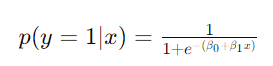

## QM-53-1 Logistische Regression

### Beschreibung

Die logistische Regression wird genutzt, um die Wahrscheinlichkeit eines Ereignisses oder eines Zustands zu schätzen, basierend auf einer oder mehreren unabhängigen Eingangsvariablen. Dies ermöglicht eine binäre Klassifikation, bspw. wenn die berechnete Wahrscheinlichkeit für die Eingangsvariablen einen bestimmten Schwellwert überschreitet. 

### Methode

#### Eindimensional: 

Hierbei steht $p(y=1∣x)$ für die Wahrscheinlichkeit, dass die abhängige Variable $y$ den Wert 1 annimmt, gegeben der unabhängigen Variable $x$. $β_0$​ und $β_1$​ sind die Regressionskoeffizienten, die die Steigung und das Interzept der logistischen Funktion bestimmen.

#### Mehrdimensional

Hierbei steht x für einen Vektor von unabhängigen Variablen und $β0​,β1​,...,βn$​ für die entsprechenden Regressionskoeffizienten.

### Sourcecode "LogisticRegression"
| RefID | Verweis                            |
| ----- | ---------------------------------- |
| 61    | QM-53-1_LogisticRegression_python  |
| 62    | QM-53-1_LogisticRegression2_python |

### Referenzen
| RefID | Verweis                                                                | Kurzbeschr.                                                                                                                                                                                                                                                                                             |
| ----- | ---------------------------------------------------------------------- | ------------------------------------------------------------------------------------------------------------------------------------------------------------------------------------------------------------------------------------------------------------------------------------------------------- |
| 100   |  An Introduction to Statistical Learning: with Applications in Python  | Präsentiert im wesentlichen ein statistisches Lernwerkzeug für Praktiker in Wissenschaft, Industrie und anderen Bereichen. Demonstriert die Anwendung der statistischen Lernmethoden in Python. Behandelt Regression, Klassifizierung, Baummethoden, SVM, Clustering, Überlebensanalyse, Deep Learning. |

