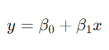
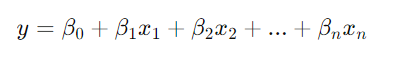

## QM-53-2 Lineare Regression

### Beschreibung

Die lineare Regression ist eine statistische Methode, die verwendet wird, um die Beziehung zwischen einer abhängigen Variablen und einer unabhängigen Variablen zu untersuchen. Das Ziel besteht darin, eine lineare Beziehung zwischen den Variablen zu modellieren, so dass die abhängige Variable als eine Funktion der unabhängigen Variable vorhergesagt werden kann.

### Formel 

#### Lineare Regression

Hierbei stehen $β_0$​ und $β_1$​ für die Regressionskoeffizienten (auch bekannt als Interzept und Steigung)

#### Multiple lineare Regression

Hierbei stehen $x_1$​,$x_2$​,...,$x_n$​ für die unabhängigen Variablen und $β_0$​,$β_1$​,...,$β_n$​ für die entsprechenden Regressionskoeffizienten.

### Sourcecode "LinearRegression"
| RefID | Verweis                           | Inhalt                                                                     |
| ----- | --------------------------------- | -------------------------------------------------------------------------- |
| 64    | QM-53-2_LinearRegression_2_python | Multiple lineare Regression - Jahre Berufserfahrung, Bildungsjahre, Gehalt |
| 63    | QM-53-2_LinearRegression_1_python | Lineare Regression - Körpergröße (in cm) und Gewicht (in kg)               |

### Referenzen
| RefID | Verweis                                                                | Kurzbeschr.                                                                                                                                                                                                                                                                                             |
| ----- | ---------------------------------------------------------------------- | ------------------------------------------------------------------------------------------------------------------------------------------------------------------------------------------------------------------------------------------------------------------------------------------------------- |
| 100   |  An Introduction to Statistical Learning: with Applications in Python  | Präsentiert im wesentlichen ein statistisches Lernwerkzeug für Praktiker in Wissenschaft, Industrie und anderen Bereichen. Demonstriert die Anwendung der statistischen Lernmethoden in Python. Behandelt Regression, Klassifizierung, Baummethoden, SVM, Clustering, Überlebensanalyse, Deep Learning. |

