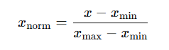

## QM-56-1 Min/Max Skalierung

### Beschreibung

Data-Scaling, oder Daten-Skalierung, im Kontext der Normalisierung im Machine Learning bezieht sich auf den Prozess der Anpassung der Skalen von Datenmerkmalen (Features), sodass sie innerhalb eines ähnlichen Wertebereichs liegen. Dies ist entscheidend, da viele maschinelle Lernalgorithmen von der Skalierung der Eingabedaten abhängen und unterschiedliche Skalen zu verzerrten oder ineffizienten Modellen führen können.

Normalisierung ist eine spezifische Methode der Daten-Skalierung. Dabei werden die Werte eines Features so transformiert, dass sie in einem bestimmten Bereich liegen, typischerweise zwischen 0 und 1. Dies wird oft durch die Min-Max-Normalisierung erreicht:

Hierbei werden die minimalen und maximalen Werte des Features verwendet, um die Skalierung durchzuführen.

### Methode

- Datensammlung:
    - Sammeln Sie den Datensatz oder das Feature, das normalisiert werden soll.

- Identifizierung der zu normalisierenden Features:
    - Bestimmen Sie, welche Features (Variablen) im Datensatz normalisiert werden müssen. Dies sind in der Regel numerische Variablen.

- Berechnung des Minimalwerts $x_min$ für jedes Feature:
    - Ermitteln Sie den kleinsten Wert jedes ausgewählten Features im Datensatz.

- Berechnung des Maximalwerts $x_max$ für jedes Feature:
    - Ermitteln Sie den größten Wert jedes ausgewählten Features im Datensatz.

- Anwendung der Min-Max Normalisierung auf jeden Datenpunkt:
    - Verwenden Sie die folgende Formel, um jeden Wert x zu normalisieren:
        - Dies skalisiert die Werte auf einen Bereich zwischen 0 und 1.

- Ersetzen oder Hinzufügen der normalisierten Werte:
    - Ersetzen Sie die ursprünglichen Werte durch die normalisierten Werte oder fügen Sie sie als neue Features hinzu.

- Überprüfung der normalisierten Daten:
    - Stellen Sie sicher, dass alle normalisierten Werte tatsächlich zwischen 0 und 1 liegen.

- Behandlung von Ausreißern (optional):
    - Überprüfen Sie, ob Ausreißer die Min-Max Normalisierung beeinflussen und erwägen Sie, diese separat zu behandeln.

- Anwendung auf neue Daten (im Falle von Modellen):
    - Bewahren Sie $x_min$​ und $x_max$​ auf, um die Normalisierung auf zukünftige oder Testdaten konsistent anzuwenden.

### Sourcecode "MinMaxDatascaling"
| RefID | Verweis                          | Inhalt                                            |
| ----- | -------------------------------- | ------------------------------------------------- |
| 71    | QM-56-1_MinMaxDatascaling_python | Python Implementierung für Min/Max Normalisierung |

### Referenzen
| RefID | Verweis                                                                        | Kurzbeschr.                                                                                                                                                                                                                                                                                                                                                                                                                                                |
| ----- | ------------------------------------------------------------------------------ | ---------------------------------------------------------------------------------------------------------------------------------------------------------------------------------------------------------------------------------------------------------------------------------------------------------------------------------------------------------------------------------------------------------------------------------------------------------- |
| 180   |  The elements of statistical learning: data mining, inference, and prediction  | Dieses Buch bietet einen umfassenden Überblick über Schlüsselkonzepte des Data Mining in Bereichen wie Medizin und Finanzen und konzentriert sich dabei auf überwachtes und unüberwachtes Lernen. Es behandelt Themen wie neuronale Netze, Boosting und fügt neue Inhalte zu Random Forests, Ensemble-Methoden und dem Umgang mit „großen“ Daten hinzu. Es ist nützlich für Statistiker und diejenigen, die in der Wissenschaft oder Industrie tätig sind. |

