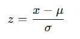

## QM-56-2 Z-Score Normalisierung

### Beschreibung

Die Z-Score-Normalisierung, auch als Standardisierung bekannt, ist eine Technik zur Skalierung von Daten, bei der die Werte eines Datensatzes so transformiert werden, dass sie einen Mittelwert von 0 und eine Standardabweichung von 1 haben. Dies ermöglicht den Vergleich von Daten, die ursprünglich unterschiedliche Skalen oder Einheiten hatten. Beim Einsatz von Regularisierungsmethoden ist es unerlässlich, genau auf mögliche Verzerrungen (Bias) zu achten, die sich unbemerkt durch die Transformation in die Daten einschleichen können.

Die Formel für die Berechnung des Z-Werts (Standardwert) eines einzelnen Datenpunkts lautet:

- x ist der ursprüngliche Datenwert.
- μ ist der Mittelwert des gesamten Datensatzes.
- σ ist die Standardabweichung des Datensatzes.
- $z$ ist der normalisierte Wert.

Z-Score Normalisierung wird auch als Standardisierung, z-Transformation, Standardnormalisierung oder "Standard Score Transformation" genannt. 

### Methode 

- Berechnung des Mittelwerts (μ) des Datensatzes.
- Berechnung der Standardabweichung (σ) des Datensatzes.
- Subtraktion des Mittelwerts von jedem Datenwert.
- Division durch die Standardabweichung für jeden zentrierten Wert.

### Sourcecode "Z-Score Normalization"
| RefID | Verweis                              | Inhalt                           |
| ----- | ------------------------------------ | -------------------------------- |
| 73    | QM-56-2 Z-Score Normalization_python | Z-Score Normalisierung in Python |

### Referenzen
| RefID | Verweis                                                                        | Kurzbeschr.                                                                                                                                                                                                                                                                                                                                                                                                                                                |
| ----- | ------------------------------------------------------------------------------ | ---------------------------------------------------------------------------------------------------------------------------------------------------------------------------------------------------------------------------------------------------------------------------------------------------------------------------------------------------------------------------------------------------------------------------------------------------------- |
| 180   |  The elements of statistical learning: data mining, inference, and prediction  | Dieses Buch bietet einen umfassenden Überblick über Schlüsselkonzepte des Data Mining in Bereichen wie Medizin und Finanzen und konzentriert sich dabei auf überwachtes und unüberwachtes Lernen. Es behandelt Themen wie neuronale Netze, Boosting und fügt neue Inhalte zu Random Forests, Ensemble-Methoden und dem Umgang mit „großen“ Daten hinzu. Es ist nützlich für Statistiker und diejenigen, die in der Wissenschaft oder Industrie tätig sind. |

