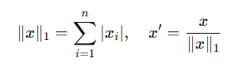

## QM-56-3 L1-Normalisierung

### Beschreibung

Die **L1-Normalisierung** (auch „Manhattan-Norm“ oder „Taxicab-Norm“ genannt) ist eine Technik der Datenvorverarbeitung, bei der ein Vektor so skaliert wird, dass die Summe der Beträge seiner Komponenten gleich 1 ist. Dadurch werden Merkmale mit unterschiedlichen Wertebereichen vergleichbar gemacht und die Interpretation als Wahrscheinlichkeits- oder Gewichtungsvektor ermöglicht. Anders als bei der L2-Norm („Euklidische Norm“) entsteht bei der L1-Norm eine „rautenförmige“ Geometrie, die zu sparsamen Darstellungen führen kann.

Hinweis: L1-Regularisierung (oft „Lasso“ genannt) ist ein verwandtes, aber grundsätzlich anderes Verfahren, das als Strafterm bei der Modellanpassung dient und nicht mit der reinen Normierung verwechselt werden darf.

### Methode

Mathematisch betrachtet wird die L1-Norm eines Vektors $x=(x_1,x_2,…,x_n)$ berechnet, indem die Summe der absoluten Werte der Komponenten gebildet wird. Durch die Anwendung der L1-Normalisierung wird jeder Bestandteil des Vektors durch die L1-Norm geteilt, sodass die Summe der absoluten Werte der normalisierten Komponenten gleich 1 ist. Dies ist besonders nützlich, wenn man mit Daten arbeitet, die auf unterschiedlichen Skalen liegen.

### Sourcecode "L1-Normalization"
| RefID | Verweis                         | Inhalt                      |
| ----- | ------------------------------- | --------------------------- |
| 74    | QM-56-3_L1-Normalization_python | L1 Normalisierung in Python |

### Referenzen
| RefID | Verweis                                                                        | Kurzbeschr.                                                                                                                                                                                                                                                                                                                                                                                                                                                |
| ----- | ------------------------------------------------------------------------------ | ---------------------------------------------------------------------------------------------------------------------------------------------------------------------------------------------------------------------------------------------------------------------------------------------------------------------------------------------------------------------------------------------------------------------------------------------------------- |
| 180   |  The elements of statistical learning: data mining, inference, and prediction  | Dieses Buch bietet einen umfassenden Überblick über Schlüsselkonzepte des Data Mining in Bereichen wie Medizin und Finanzen und konzentriert sich dabei auf überwachtes und unüberwachtes Lernen. Es behandelt Themen wie neuronale Netze, Boosting und fügt neue Inhalte zu Random Forests, Ensemble-Methoden und dem Umgang mit „großen“ Daten hinzu. Es ist nützlich für Statistiker und diejenigen, die in der Wissenschaft oder Industrie tätig sind. |
| 290   |  Regression Shrinkage and Selection via the Lasso                              | Der Artikel führt die Lasso-Methode ein, eine Regressionsform, die durch gleichzeitige Variablenselektion und Regularisierung sparsamer und interpretierbarer Modelle ermöglicht.                                                                                                                                                                                                                                                                          |

